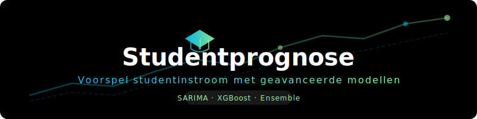

<div align="center">
  <a href="https://github.com/cedanl/studentprognose">
    
  </a>

  <h3>Voorspel je studentinstroom maanden vooruit — met je eigen data, op je eigen machine.</h3>

  <p>
    <a href="https://www.voxweb.nl/nieuws/de-universiteit-heeft-nu-haar-eigen-glazen-bol-nieuw-model-voorspelt-toekomstige-instroom-van-studenten"></a>
    <a href="https://github.com/cedanl"></a>
    
    
    <br>
    <a href="#"></a>
    
    <a href="#"></a>
    <a href="#"></a>
    <a href="#"></a>
  </p>

</div>

---

## 📦 Aan de slag

```bash
# 1. Installeer uv (zie https://docs.astral.sh/uv/getting-started/installation/)
curl -LsSf https://astral.sh/uv/install.sh | sh

# 2. Clone de repository
git clone https://github.com/cedanl/studentprognose.git
cd studentprognose

# 3. Draai het model met demodata
uv run main.py
```

> [!NOTE]
> Demodata is meegeleverd in `data/input`, zodat je direct kunt starten. Controleer welke jaren en weken beschikbaar zijn — zonder specificatie gebruikt het script de huidige week, wat mogelijk niet werkt met de meegeleverde data.

---

## 🗃️ Studielink Data

> [!IMPORTANT]
> Dit model werkt met **Studielink-telbestanden**. Je hebt deze data nodig om voorspellingen te maken voor jouw instelling. Demodata is meegeleverd zodat je het model eerst kunt uitproberen.

---

## Waarom dit model?

Dit model is gebouwd voor **data-analisten bij Nederlandse onderwijsinstellingen** die werken met Studielink-data. Je hebt geen machine learning-expertise nodig.

| | |
|---|---|
| **Bring Your Own Data** | Je levert je eigen data aan — er wordt niets extern gedeeld |
| **Privacy-vriendelijk** | Draait volledig lokaal op je eigen machine |
| **Open source** | Transparant, aanpasbaar en gratis te gebruiken |
| **Demo data inbegrepen** | Direct uitproberen zonder eigen data — demobestanden zitten in `data/input` |

---

## ✨ Gebruik

### Jaren en weken

Specificeer jaar en week met `-y` en `-w`:

```bash
uv run main.py -w 6 -y 2024
uv run main.py -W 1 2 3 -Y 2024
uv run main.py -year 2023 2024
uv run main.py -week 40 41
```

Gebruik slicing voor een reeks weken:

```bash
uv run main.py -w 10 : 20 -y 2023
```

### Datasets

Er zijn twee datasets beschikbaar: **individual** (per student) en **cumulative** (geaggregeerd per opleiding/herkomst/jaar/week). Standaard worden beide gebruikt.

```bash
uv run main.py -d individual
uv run main.py -D cumulative
uv run main.py -dataset both
```

### Configuratie

Het standaard configuratiebestand is `configuration/configuration.json`. Dit kan worden overschreven:

```bash
uv run main.py -c pad/naar/configuration.json
uv run main.py -configuration langer/pad/naar/config.json
```

### Filtering

Het filterbestand bepaalt welke opleidingen, herkomst en examentypen worden meegenomen. Standaard: `configuration/filtering/base.json`.

```bash
uv run main.py -f pad/naar/filtering.json
uv run main.py -filtering langer/pad/naar/filtering.json
```

Voorbeeld van een filterbestand:

```json
{
    "filtering": {
        "programme": ["B Sociologie"],
        "herkomst": ["NL", "EER"],
        "examentype": ["Bachelor"]
    }
}
```

### Studentjaarvoorspelling

Kies welk type voorspelling je wilt maken:

```bash
uv run main.py -sy first-years    # Eerstejaars (standaard)
uv run main.py -sy higher-years   # Hogerjaars
uv run main.py -sy volume         # Totaal volume
```

### Uitgebreid voorbeeld

Voorspel eerstejaars voor 2023 en 2024, weken 10 t/m 20, met beide datasets:

```bash
uv run main.py -y 2023 2024 -w 10 : 20 -d b
```

Voorspel eerstejaars voor collegejaar 2025/2026, week 5, alleen cumulatief:

```bash
uv run main.py -y 2025 -w 5 -d c
```

### Syntax overzicht

| Instelling              | Korte notatie  | Lange notatie    | Opties                                      |
|-------------------------|----------------|------------------|---------------------------------------------|
| Voorspellingsjaren      | `-y` of `-Y`   | `-year`          | Eén of meer jaren, bijv. `2023 2024`        |
| Voorspellingsweken      | `-w` of `-W`   | `-week`          | Eén of meer weken, bijv. `10 11 12`         |
| Slicing                 |                |                  | Gebruik `:` voor reeksen, bijv. `10 : 20`   |
| Dataset                 | `-d` of `-D`   | `-dataset`       | `i`/`individual`, `c`/`cumulative`, `b`/`both` |
| Configuratie            | `-c` of `-C`   | `-configuration` | Pad naar configuratiebestand                |
| Filtering               | `-f` of `-F`   | `-filtering`     | Pad naar filterbestand                      |
| Studentjaarvoorspelling | `-sy` of `-SY` | `-studentyear`   | `f`/`first-years`, `h`/`higher-years`, `v`/`volume` |
| Skip jaren              | `-sk` of `-SK` | `-skipyears`     | Aantal jaren om over te slaan               |
---

## 🔧 Standalone scripts

### Studentaantallen berekenen

Genereert bestanden met geaggregeerde studentaantallen op basis van Octoberdata:

```bash
uv run scripts/standalone/calculate_student_count.py
```

### Ensemble gewichten berekenen

Berekent gewichten voor de ensemble-voorspelling op basis van eerdere prestaties:

```bash
uv run scripts/standalone/calculate_ensemble_weights.py
uv run scripts/standalone/calculate_ensemble_weights.py -y 2023
uv run scripts/standalone/calculate_ensemble_weights.py -year 2023 2024
uv run scripts/standalone/calculate_ensemble_weights.py -y 2022 : 2024
```

### Studentaantallen toevoegen en fouten berekenen

Bij voorspellingen voor historische jaren worden werkelijke aantallen automatisch toegevoegd. Voor toekomstige jaren kun je, zodra de werkelijke data beschikbaar zijn, het volgende uitvoeren:

```bash
uv run scripts/standalone/append_studentcount_and_compute_errors.py
```

### Studielink data transformeren

Transformeert ruwe Studielink-telbestanden naar het cumulatieve dataformaat dat het model gebruikt:

```bash
uv run scripts/standalone/rowbind_and_reformat_studielink_data.py
```

---

## 📈 Hogerjaars voorspellen

De voorspelling voor hogerjaars studenten is gebaseerd op een lineair model:

$$
\text{volgend jaar hogerjaars} = \text{huidig jaar hogerjaars} + (\text{huidig jaar eerstejaars} \times \text{ratio doorstroom}) - (\text{huidig jaar hogerjaars} \times \text{ratio uitval})
$$

De ratio's worden automatisch berekend op basis van de drie voorgaande jaren.

```bash
uv run scripts/higher_years/higher_years.py
uv run scripts/higher_years/higher_years.py -y 2023
uv run scripts/higher_years/higher_years.py -year 2023 2024
uv run scripts/higher_years/higher_years.py -y 2022 : 2024
```

---

## 📁 Beschrijving van bestanden

### Input

| Bestand | Beschrijving |
|---------|-------------|
| **individual** | Individuele (voor)aanmeldingen per student. Wordt gebruikt voor de SARIMA_individual voorspelling. |
| **cumulative** | Aantal aanmeldingen per opleiding, herkomst, jaar, week en herinschrijving/hogerejaars. Wordt gebruikt voor de SARIMA_cumulative voorspelling. Verkregen via Studielink. |
| **latest** | Per opleiding, herkomst, jaar en week: aanmeldingen, voorspellingen en foutwaarden (MAE/MAPE). Wordt gebruikt voor volume- en hogerjaarsvoorspellingen. |
| **student_count_first-years** | Werkelijk aantal eerstejaars studenten per jaar, opleiding en herkomst. |
| **student_count_higher-years** | Werkelijk aantal hogerjaars studenten per jaar, opleiding en herkomst. |
| **student_volume** | Werkelijk totaal aantal studenten (eerstejaars + hogerjaars) per jaar, opleiding en herkomst. |
| **distances** | Afstanden van woonplaatsen in Nederland tot de universiteit. Wordt samengevoegd met individuele data voor XGBoost. |
| **weighted_ensemble** | Gewichten per model voor de ensemble-voorspelling. |

### Output

| Bestand | Beschrijving |
|---------|-------------|
| **output_prelim.xlsx** | Voorlopige output met alle voorspellingen van de huidige run. |
| **output_first-years.xlsx** | Volledige output met voorspellingen voor eerstejaars studenten. |
| **output_higher-years.xlsx** | Volledige output met voorspellingen voor hogerjaars studenten. |
| **output_volume.xlsx** | Volledige output met volume-voorspellingen (totaal). |

---

## 🏗️ Architectuur

Zie de [Technische README](doc/TECHNICAL_README.md) voor meer details over de architectuur.

---

## 🤝 Bijdragen

Dit project wordt actief onderhouden door [CEDA](https://github.com/cedanl). Wil je bijdragen of meedenken? Sluit je aan bij de [werkgroep](https://edu.nl/6d69d).

## 🆘 Ondersteuning

Voor vragen of problemen:
- **GitHub Issues**: [Probleem melden](https://github.com/cedanl/studentprognose/issues)

---

<div align="center">
  <sub>Gebouwd met ❤️ door de <a href="https://github.com/cedanl">CEDANL</a> community</sub>
</div>

