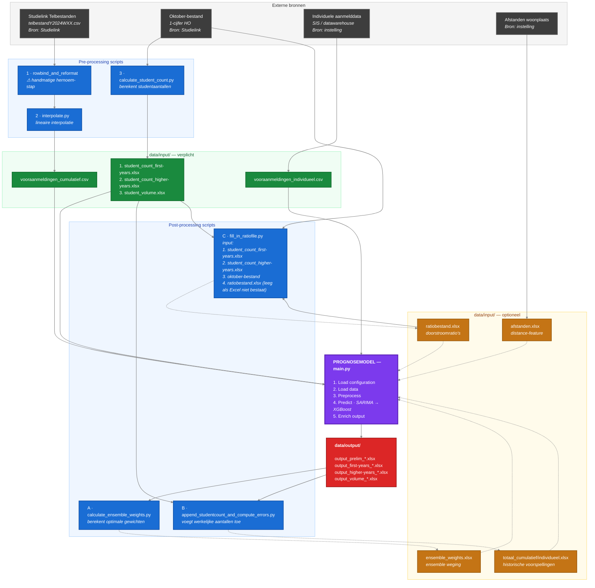

# Dataflow: van Studielink naar Prognose

Dit document beschrijft hoe ruwe Studielink-data en instellingsdata worden getransformeerd naar de bestanden in `data/input/`, en hoe die vervolgens door het prognosemodel worden verwerkt tot output.

---

## Wat moet ik aanleveren?

Onderstaande tabel geeft een overzicht van de bestanden die een instelling moet klaarzetten in `data/input/` om het prognosemodel te draaien.

### 🟢 Verplichte bestanden

| Bestand | Beschrijving | Bron | Wanneer nodig |
|---------|-------------|------|---------------|
| `vooraanmeldingen_cumulatief.csv` | Gewogen/ongewogen vooraanmelders per opleiding, herkomst, week, jaar | Studielink telbestanden → pre-processing stap 1 + 2 | Bij `-d c` of `-d b` (default) |
| `vooraanmeldingen_individueel.csv` | Een rij per student-aanmelding met persoonskenmerken | Direct uit SIS/datawarehouse van de instelling | Bij `-d i` of `-d b` (default) |
| `student_count_first-years.xlsx` | Werkelijk aantal eerstejaars per opleiding/herkomst/jaar | Oktober-bestand (1-cijfer HO) → pre-processing stap 3 | Altijd |

### 🟠 Optionele bestanden

| Bestand | Beschrijving | Bron |
|---------|-------------|------|
| `afstanden.xlsx` | Afstanden woonplaats → instelling per plaats | Direct van instelling |
| `ensemble_weights.xlsx` | Gewichten voor ensemble weging | Gegenereerd door post-processing stap A |
| `totaal_cumulatief.xlsx` / `totaal_individueel.xlsx` | Historische voorspellingen (eerdere model-runs) | Gegenereerd door post-processing stap B |
| `ratiobestand.xlsx` | Doorstroomratio's eerstejaars → hogerjaars | Gegenereerd door post-processing stap C |

> Bij een eerste run zijn de optionele post-processing bestanden nog niet beschikbaar. Het model draait zonder — ze worden pas aangemaakt na de eerste model-run via de post-processing scripts.

---

## Overzicht



<details>
<summary>Gedetailleerd ASCII-diagram (klik om uit te klappen)</summary>

```
                              EXTERNE BRONNEN
  ┌───────────────────────┐ ┌──────────────────────┐ ┌───────────────────────┐ ┌────────────────────────┐
  │  Studielink           │ │  Oktober-bestand     │ │  Individuele          │ │  Afstanden woonplaats  │
  │  Telbestanden         │ │  (1-cijfer HO)       │ │  aanmelddata (SIS)    │ │  → instelling          │
  │  (telbestandY2024     │ │                      │ │                       │ │                        │
  │   WXX.csv per week)   │ │  Bron: instelling    │ │  Bron: instelling     │ │  Bron: instelling      │
  │                       │ │                      │ │  (SIS/datawarehouse)  │ │                        │
  └───────────┬───────────┘ └──────────┬───────────┘ └───────────┬───────────┘ └────────────┬───────────┘
              │                        │                         │                          │
              │                        │                         │                          │
     STANDALONE ETL SCRIPTS            │                         │                          │
     (pre-processing)                  │                         │                          │
              │                        │                         │                          │
              ▼                        │                         │                          │
  ┌───────────────────────────────┐    │                         │                          │
  │  1. rowbind_and_reformat_     │    │                         │                          │
  │     studielink_data.py        │    │                         │                          │
  │     scripts/standalone/       │    │                         │                          │
  │                               │    │                         │                          │
  │  Input:  Studielink tel-      │    │                         │                          │
  │          bestanden            │    │                         │                          │
  │  Acties:                      │    │                         │                          │
  │    - Bind wekelijkse CSV's    │    │                         │                          │
  │    - Voegt weeknummer toe     │    │                         │                          │
  │    - Berekent gewogen         │    │                         │                          │
  │      vooraanmelders           │    │                         │                          │
  │    - Hernoemt kolommen,       │    │                         │                          │
  │      vertaalt codes           │    │                         │                          │
  │  Output: rowbinded.csv        │    │                         │                          │
  │                               │    │                         │                          │
  │  ⚠ HANDMATIGE STAP:           │    │                         │                          │
  │  rowbinded.csv hernoemen naar │    │                         │                          │
  │  vooraanmeldingen_            │    │                         │                          │
  │  cumulatief.csv               │    │                         │                          │
  └───────────────┬───────────────┘    │                         │                          │
                  │                    │                         │                          │
                  ▼                    │                         │                          │
  ┌───────────────────────────────┐    │                         │                          │
  │  2. interpolate.py            │    │                         │                          │
  │     scripts/standalone/       │    │                         │                          │
  │                               │    │                         │                          │
  │  Input:  vooraanmeldingen_    │    │                         │                          │
  │          cumulatief.csv       │    │                         │                          │
  │  Acties: Lineaire inter-      │    │                         │                          │
  │          polatie ontbrekende  │    │                         │                          │
  │          weken                │    │                         │                          │
  │  Output: vooraanmeldingen_    │    │                         │                          │
  │          cumulatief.csv       │    │                         │                          │
  └───────────────┬───────────────┘    │                         │                          │
                  │                    │                         │                          │
                  │                    ▼                         │                          │
                  │   ┌─────────────────────────────────┐        │                          │
                  │   │  3. calculate_student_count.py  │        │                          │
                  │   │     scripts/standalone/         │        │                          │
                  │   │                                 │        │                          │
                  │   │  Input:  Oktober-bestand        │        │                          │
                  │   │          (1-cijfer HO)          │        │                          │
                  │   │  Acties: Berekent student-      │        │                          │
                  │   │          aantallen per          │        │                          │
                  │   │          opleiding/herkomst/    │        │                          │
                  │   │          jaar                   │        │                          │
                  │   │  Output:                        │        │                          │
                  │   │   - student_count_first-        │        │                          │
                  │   │     years.xlsx                  │        │                          │
                  │   │   - student_count_higher-       │        │                          │
                  │   │     years.xlsx                  │        │                          │
                  │   │   - student_volume.xlsx         │        │                          │
                  │   └───────────────┬─────────────────┘        │                          │
                  │                   │                          │                          │
                  ▼                   ▼                          │        ┌─────────────────┘
                  │                   │                          │        │
                  ▼                   ▼                          ▼        ▼
┌──────────────────────────────────────────────────────────────────────────────┐
│                        data/input/ (Model Input)                             │
│                                                                              │
│  Bestanden geladen door load_data.py via configuration.json:                 │
│                                                                              │
│  ┌────────────────────────────────────────────────────────────────────────┐  │
│  │  vooraanmeldingen_cumulatief.csv                     🟢 [VERPLICHT]   │  │
│  │  Verplicht bij -d c of -d b (default).                                │  │
│  │  Cumulatief: gewogen/ongewogen vooraanmelders per opleiding,          │  │
│  │  herkomst, week, jaar.                                                │  │
│  │  Bron: Studielink → stap 1 → stap 2                                   │  │
│  │  Gebruikt door: main.py → SARIMA_cumulative                           │  │
│  └────────────────────────────────────────────────────────────────────────┘  │
│                                                                              │
│  ┌────────────────────────────────────────────────────────────────────────┐  │
│  │  vooraanmeldingen_individueel.csv                    🟢 [VERPLICHT]   │  │
│  │  Verplicht bij -d i of -d b (default).                                │  │
│  │  Individueel: een rij per student-aanmelding met persoonskenmerken.   │  │
│  │  Bron: DIRECT van instelling (SIS/datawarehouse) — geen ETL-script.   │  │
│  │  Gebruikt door: main.py → SARIMA_individual                           │  │
│  └────────────────────────────────────────────────────────────────────────┘  │
│                                                                              │
│  ┌────────────────────────────────────────────────────────────────────────┐  │
│  │  student_count_first-years.xlsx                      🟢 [VERPLICHT]   │  │
│  │  Altijd verplicht — wordt onvoorwaardelijk geladen.                   │  │
│  │  Werkelijk aantal eerstejaars per opleiding/herkomst/jaar             │  │
│  │  Bron: Oktober-bestand → stap 3                                       │  │
│  │  Gebruikt door: main.py → hogerjaars-voorspelling en doorstroomratio's│  │
│  └────────────────────────────────────────────────────────────────────────┘  │
│                                                                              │
│  ┌────────────────────────────────────────────────────────────────────────┐  │
│  │  afstanden.xlsx                                      🟠 [OPTIONEEL]   │  │
│  │  Model draait zonder; distance-feature wordt overgeslagen.            │  │
│  │  Afstanden woonplaats → instelling per plaats.                        │  │
│  │  Bron: DIRECT van instelling — geen ETL-script.                       │  │
│  │  Gebruikt door: main.py → individuele dataholder (feature)            │  │
│  └────────────────────────────────────────────────────────────────────────┘  │
│                                                                              │
│  ┌ ─ ─ ─ ─ ─ ─ ─ ─ ─ ─ ─ ─ ─ ─ ─ ─ ─ ─ ─ ─ ─ ─ ─ ─ ─ ─ ─ ─ ─ ─ ─ ─ ┐   │
│    input_postprocessing (gegenereerd door post-processing, feedback loop)    │
│  │ Alle bestanden hieronder zijn 🟠 OPTIONEEL — model draait zonder.  │   │
│                                                                              │
│  │ ┌──────────────────────────────────────────────────────────────────┐│   │
│    │  ensemble_weights.xlsx                         🟠 [OPTIONEEL]   │     │
│  │ │  Gewichten per opleiding/herkomst voor ensemble weging.         ││   │
│    │  Bron: gegenereerd door post-processing stap A.                  │     │
│  │ │  Gebruikt door: main.py → ensemble weging van voorspellingen    ││   │
│    └──────────────────────────────────────────────────────────────────┘     │
│  │                                                                     │   │
│    ┌──────────────────────────────────────────────────────────────────┐     │
│  │ │  totaal_cumulatief/individueel.xlsx            🟠 [OPTIONEEL]   ││   │
│    │  Resultaten van eerdere model-runs.                              │     │
│  │ │  Bron: gegenereerd door post-processing stap B.                 ││   │
│    │  Gebruikt door: main.py → referentie voor nieuwe voorspellingen  │     │
│  │ └──────────────────────────────────────────────────────────────────┘│   │
│                                                                              │
│  │ ┌──────────────────────────────────────────────────────────────────┐│   │
│    │  ratiobestand.xlsx                             🟠 [OPTIONEEL]   │     │
│  │ │  Doorstroomratio's per opleiding/herkomst.                      ││   │
│    │  Bron: gegenereerd door post-processing stap C.                  │     │
│  │ │  Gebruikt door: main.py → hogerjaars (momenteel uitgeschakeld)  ││   │
│    └──────────────────────────────────────────────────────────────────┘     │
│  └ ─ ─ ─ ─ ─ ─ ─ ─ ─ ─ ─ ─ ─ ─ ─ ─ ─ ─ ─ ─ ─ ─ ─ ─ ─ ─ ─ ─ ─ ─ ─ ─ ┘   │
│                                                                              │
└──────────────────────────────────┬───────────────────────────────────────────┘
                                   │
                                   ▼
┌──────────────────────────────────────────────────────────────────────────────┐
│                     🟣 PROGNOSEMODEL (main.py)                               │
│                                                                              │
│  1. Load configuration    (configuration/configuration.json)                 │
│  2. Load data             (scripts/load_data.py)                             │
│  3. Initialize dataholder (keuze op basis van -d flag):                      │
│     ┌──────────────────┐  ┌──────────────────┐  ┌──────────────────┐         │
│     │ -d i             │  │ -d c             │  │ -d b (default)   │         │
│     │ Individual       │  │ Cumulative       │  │ BothDatasets     │         │
│     │ SARIMA op        │  │ SARIMA op        │  │ Combinatie van   │         │
│     │ vooraanmeldingen │  │ vooraanmeldingen │  │ beide + ensemble │         │
│     │ _individueel.csv │  │ _cumulatief.csv  │  │ weging           │         │
│     └──────────────────┘  └──────────────────┘  └──────────────────┘         │
│  4. Preprocess            (scripts/transform_data.py)                        │
│  5. Predict               (SARIMA + ratio-model + ensemble weging)           │
│  6. Postprocess           (voegt studentaantallen, faculteit, etc. toe)      │
│                                                                              │
└──────────────────────────────────┬───────────────────────────────────────────┘
                                   │
                                   ▼
┌──────────────────────────────────────────────────────────────────────────────┐
│                     🔴 data/output/ (Resultaten)                             │
│                                                                              │
│  - output_prelim_*.xlsx        Voorlopige voorspellingen huidige run         │
│  - output_first-years_*.xlsx   Voorspellingen eerstejaars studenten          │
│  - output_higher-years_*.xlsx  Voorspellingen hogerjaars studenten           │
│  - output_volume_*.xlsx        Volume-voorspellingen (totaal)                │
│                                                                              │
└──────────────────────────────────┬───────────────────────────────────────────┘
                                   │
                                   ▼
     🔵 STANDALONE POST-PROCESSING SCRIPTS
     (draaien NA model-runs, output voedt terug naar data/input/)

  ┌───────────────────────────────────────────────────────────────┐
  │  A. calculate_ensemble_weights.py                             │
  │     scripts/standalone/                                       │
  │                                                               │
  │  Input:  totaal_cumulatief.xlsx (eerdere model-runs)          │
  │          ensemble_weights.xlsx (bestaande gewichten)          │
  │  Acties: Berekent optimale ensemble gewichten per opleiding   │
  │          op basis van historische voorspelfouten              │
  │  Output: ensemble_weights.xlsx (bijgewerkt)                   │
  └───────────────────────────────────────────────────────────────┘

  ┌───────────────────────────────────────────────────────────────┐
  │  B. append_studentcount_and_compute_errors.py                 │
  │     scripts/standalone/                                       │
  │                                                               │
  │  Input:  totaal_cumulatief.xlsx / totaal_individueel.xlsx     │
  │          student_count_first-years.xlsx                       │
  │          student_count_higher-years.xlsx                      │
  │  Acties: Voegt werkelijke studentaantallen toe aan            │
  │          historische voorspellingen en berekent fouten        │
  │  Output: totaal_cumulatief.xlsx / totaal_individueel.xlsx     │
  │          (bijgewerkt)                                         │
  └───────────────────────────────────────────────────────────────┘

  ┌───────────────────────────────────────────────────────────────┐
  │  C. fill_in_ratiofile.py                                      │
  │     scripts/higher_years/                                     │
  │                                                               │
  │  Input:  student_count_first-years.xlsx                       │
  │          student_count_higher-years.xlsx                      │
  │          ratiobestand.xlsx (bestaand)                         │
  │  Acties: Berekent doorstroomratio's eerstejaars →             │
  │          hogerjaars per opleiding/herkomst                    │
  │  Output: ratiobestand.xlsx (bijgewerkt)                       │
  └───────────────────────────────────────────────────────────────┘

         │                    │                    │
         ▼                    ▼                    ▼
     ┌─────────────────────────────────────────────────┐
     │  🟡 Feedback loop → terug naar data/input/      │
     │  voor volgende model-run                        │
     └─────────────────────────────────────────────────┘

Afhankelijkheden samengevat:

  PRE-PROCESSING:
  Studielink telbestanden ──► stap 1 ──► stap 2 ──────────────────────────► data/input/
  Oktober-bestand ─────────────────────► stap 3 ──────────────────────────► data/input/
  Individuele aanmelddata (SIS) ──────────────────────────────────► data/input/
  Afstanden (instelling) ────────────────────────────────────────►  data/input/

  POST-PROCESSING (feedback loop):
  data/output/ ──► stap A (ensemble weights) ──► data/input/ensemble_weights.xlsx
  data/output/ ──► stap B (append + errors)  ──► data/input/totaal_*.xlsx
  stap 3       ──► stap C (fill ratiofile)   ──► data/input/ratiobestand.xlsx
```

</details>

---

## ETL Scripts Overzicht

### Pre-processing (voor model-run)

| Stap | Script | Input | Output |
|------|--------|-------|--------|
| 1 | `scripts/standalone/rowbind_and_reformat_studielink_data.py` | Studielink telbestanden (`telbestandY2024WXX.csv`) | `rowbinded.csv` → hernoemen naar `vooraanmeldingen_cumulatief.csv` |
| 2 | `scripts/standalone/interpolate.py` | `vooraanmeldingen_cumulatief.csv` | `vooraanmeldingen_cumulatief.csv` (met geinterpoleerde weken) |
| 3 | `scripts/standalone/calculate_student_count.py` | Oktober-bestand (1-cijfer HO) | `student_count_first-years.xlsx`, `student_count_higher-years.xlsx`, `student_volume.xlsx` |

### Post-processing (na model-run, feedback loop)

| Stap | Script | Input | Output |
|------|--------|-------|--------|
| A | `scripts/standalone/calculate_ensemble_weights.py` | `totaal_cumulatief.xlsx` + `ensemble_weights.xlsx` | `ensemble_weights.xlsx` (bijgewerkt) |
| B | `scripts/standalone/append_studentcount_and_compute_errors.py` | `totaal_*.xlsx` + `student_count_*.xlsx` | `totaal_*.xlsx` (bijgewerkt met werkelijke aantallen + fouten) |
| C | `scripts/higher_years/fill_in_ratiofile.py` | `student_count_*.xlsx` + `ratiobestand.xlsx` | `ratiobestand.xlsx` (bijgewerkt) |

---

## Twee databronnen, twee sporen

**Cumulatief spoor (Studielink → model)**
Studielink levert wekelijks telbestanden met geaggregeerde aanmeldcijfers per opleiding. Deze worden samengevoegd door `rowbind_and_reformat_studielink_data.py` (stap 1) tot `rowbinded.csv`. De gebruiker moet dit bestand vervolgens **handmatig hernoemen/verplaatsen** naar `data/input/vooraanmeldingen_cumulatief.csv` (het script heeft placeholder-paden op regel 4 en 108). Daarna kan `interpolate.py` (stap 2) ontbrekende weken interpoleren. Samen vormen ze de basis voor de `SARIMA_cumulative` voorspelling.

**Individueel spoor (instelling → model)**
De instelling levert per-student aanmelddata uit het eigen SIS/datawarehouse. Dit bestand wordt **direct aangeleverd** als `vooraanmeldingen_individueel.csv` — er is geen ETL-script voor nodig. Het vormt de basis voor de `SARIMA_individual` voorspelling.

**Studentaantallen (oktober-bestand → ground truth)**
Het oktober-bestand (1-cijfer HO) bevat de werkelijke inschrijvingen na 1 oktober. `calculate_student_count.py` leidt hieruit de ground truth af die het model als referentie gebruikt.

Het prognosemodel combineert beide sporen via ensemble weging om een voorspelling te maken van het verwachte aantal studenten.
