# Dataflow: van Studielink naar Prognose

Dit document beschrijft hoe ruwe Studielink-data en instellingsdata worden getransformeerd naar de bestanden in `data/input/`, en hoe die vervolgens door het prognosemodel worden verwerkt tot output.

---

## Wat moet ik aanleveren?

### Verplichte bestanden

| Bestand | Beschrijving | Bron | Wanneer nodig |
|---------|-------------|------|---------------|
| `vooraanmeldingen_cumulatief.csv` | Gewogen/ongewogen vooraanmelders per opleiding, herkomst, week, jaar | Studielink telbestanden (extern) → ETL stap 1 + 2 | Bij `-d c` of `-d b` (default) |
| `vooraanmeldingen_individueel.csv` | Een rij per student-aanmelding met persoonskenmerken | Osiris/Usis (intern) → ETL stap 4 | Bij `-d i` of `-d b` (default) |
| `student_count_first-years.xlsx` | Werkelijk aantal eerstejaars per opleiding/herkomst/jaar | 1cijferHO-vergelijkbaar bestand (DUO 1cijferHO-formaat, eigen levering instelling) → ETL stap 3 | Altijd |
| `student_volume.xlsx` | Totaal studentvolume per opleiding/herkomst/jaar | 1cijferHO-vergelijkbaar bestand (DUO 1cijferHO-formaat, eigen levering instelling) → ETL stap 3 | Alleen bij `-sy v` |

### Optionele bestanden

| Bestand | Beschrijving | Bron |
|---------|-------------|------|
| `ensemble_weights.xlsx` | Gewichten per model voor de ensemble-voorspelling | Gegenereerd door post-processing stap A |
| `totaal_cumulatief.xlsx` / `totaal_individueel.xlsx` | Historische voorspellingen (eerdere model-runs) | Gegenereerd door post-processing stap B |

> Bij een eerste run zijn de optionele post-processing bestanden nog niet beschikbaar. Het model draait zonder — ze worden pas aangemaakt na de eerste model-run via de post-processing scripts.

---

## Overzicht

```mermaid
flowchart TD
    classDef bron fill:#3d3d3d,color:#fff,stroke:#555,stroke-width:2px
    classDef script fill:#1a6dd4,color:#fff,stroke:#0d4ea6,stroke-width:2px
    classDef verplicht fill:#1a8a3e,color:#fff,stroke:#136b2e,stroke-width:2px
    classDef optioneel fill:#c47415,color:#fff,stroke:#9a5c10,stroke-width:2px
    classDef model fill:#7c3aed,color:#fff,stroke:#5b21b6,stroke-width:3px
    classDef output fill:#dc2626,color:#fff,stroke:#991b1b,stroke-width:2px

    linkStyle default stroke:#888,stroke-width:1.5px

    %% ══════════════════════════════════════
    %% LAAG 1 — Databronnen
    %% ══════════════════════════════════════
    subgraph bronnen ["Databronnen — data/input_raw/"]
        direction LR
        subgraph bronnen_extern ["Externe bronnen"]
            SL["Studielink Telbestanden<br/><i>telbestandY2024WXX.csv</i><br/><b>Bron: Studielink</b>"]:::bron
        end
        subgraph bronnen_intern ["Interne bronnen (instelling levert zelf)"]
            OKT["1cijferHO-vergelijkbaar bestand<br/><i>oktober_bestand.xlsx</i><br/><b>Formaat: DUO 1cijferHO</b>"]:::bron
            SIS["Individuele aanmelddata<br/><i>per student-aanmelding</i><br/><b>Bron: Osiris / Usis</b>"]:::bron
        end
    end

    %% ══════════════════════════════════════
    %% LAAG 2 — ETL (etl.py)
    %% ══════════════════════════════════════
    subgraph etl ["ETL — etl.py (standaard, skip met --noetl)"]
        direction LR
        S1["Rowbind + reformat<br/><i>samenvoegen telbestanden</i>"]:::script
        S2["Interpolate<br/><i>ontbrekende weken</i>"]:::script
        S3["Calculate student count<br/><i>1cijferHO-vergelijkbaar → aantallen</i>"]:::script
        S4["Copy bestanden<br/><i>individueel</i>"]:::script
    end

    %% ══════════════════════════════════════
    %% LAAG 3 — data/input/
    %% ══════════════════════════════════════
    subgraph input_verplicht ["Databronnen — data/input/"]
        direction LR
        VC["vooraanmeldingen_cumulatief.csv"]:::verplicht
        VI["vooraanmeldingen_individueel.csv"]:::verplicht
        SC["student_count_first-years.xlsx"]:::verplicht
        SCV["student_volume.xlsx<br/><i>alleen bij -sy v</i>"]:::optioneel
    end

    %% ══════════════════════════════════════
    %% LAAG 4 — Prognosemodel
    %% ══════════════════════════════════════
    subgraph pipeline ["Prognosemodel"]
        direction TD

        LOAD["<b>loader</b> → <b>preprocessing/add_zero_weeks</b> *<br/><i>data laden + nulweken toevoegen</i>"]:::script

        LOAD --> IND_PATH & CUM_PATH & BOTH_PATH

        subgraph IND_PATH ["-d individual"]
            direction TD
            I_PRE["strategies/individual<br/><i>preprocessing</i>"]
            I_S05["<b>xgboost_classifier</b><br/><i>kans per student</i>"]
            I_S06["<b>transforms</b><br/><i>pivot + cumsum</i>"]
            I_S07["<b>sarima</b><br/><i>SARIMA individual</i>"]
            I_PRE --> I_S05 --> I_S06 --> I_S07
        end

        subgraph CUM_PATH ["-d cumulative"]
            direction TD
            C_PRE["strategies/cumulative<br/><i>preprocessing</i>"]
            C_S07["<b>sarima</b> → <b>transforms</b><br/><i>SARIMA cumulative</i>"]
            C_S08["<b>xgboost_regressor</b><br/><i>vooraanmelders → inschrijvingen</i>"]
            C_PRE --> C_S07 --> C_S08
        end

        subgraph BOTH_PATH ["-d both"]
            direction TD
            B_PRE["strategies/combined<br/><i>preprocessing beide</i>"]
            B_S05["<b>xgboost_classifier</b>"]
            B_S06["<b>transforms</b>"]
            B_S07["<b>sarima</b><br/><i>individual + cumulative</i>"]
            B_S08["<b>xgboost_regressor</b>"]
            B_PRE --> B_S05 --> B_S06 --> B_S07 --> B_S08
        end

        subgraph S10 ["postprocessor"]
            direction TD
            S10A["<b>prepare_data_for_output_prelim</b><br/><i>NF-cap, kolommen, merges</i>"]:::script
            S10B["<b>predict_with_ratio</b><br/><i>ratio (alleen cum/both)</i>"]:::script
            S10C["<b>postprocess</b><br/><i>ensemble (both), foutmaten</i>"]:::script
            S10A --> S10B --> S10C
        end

        I_S07 --> S10A
        C_S08 --> S10A
        B_S08 --> S10A
    end

    %% ══════════════════════════════════════
    %% LAAG 5 — Output
    %% ══════════════════════════════════════
    S10A -.-> OUT_PRELIM
    OUT_PRELIM["<b>data/output/</b><br/><i>output_prelim_*.xlsx</i><br/>(tussenresultaat)"]:::output
    OUT["<b>data/output/</b><br/><br/>output_first-years_*.xlsx<br/><i>output_volume_*.xlsx (bij -sy v)</i>"]:::output

    %% ══════════════════════════════════════
    %% LAAG 6 — Post-processing (archive/)
    %% ══════════════════════════════════════
    subgraph postproc ["Post-processing scripts (archive/) **"]
        direction LR
        PA["A · calculate_ensemble_weights.py<br/><i>optimale gewichten</i>"]:::script
        PB["B · append_studentcount_and_compute_errors.py<br/><i>werkelijke aantallen + fouten</i>"]:::script
        FOOTNOTE["** Optionele flow: post-processing scripts genereren bestanden<br/>(ensemble_weights.xlsx, totaal_*.xlsx) die als input kunnen<br/>worden gebruikt bij de volgende model-run."]
        style FOOTNOTE fill:none,stroke:none,color:#666
    end

    %% ── Bronnen → ETL ──
    SL --> S1 --> S2 --> VC
    OKT --> S3 --> SC
    SIS --> S4 --> VI

    %% ── data/input → Model ──
    VC & VI & SC --> LOAD

    %% ── Postprocessor → Output ──
    S10C ==> OUT

    %% ── Output → Post-processing ──
    OUT --> PA
    OUT --> PB
    SC --> PB

    %% ── Subgraph styling ──
    style bronnen fill:#f5f5f5,stroke:#bbb,stroke-width:1px,color:#333
    style bronnen_extern fill:#f5f5f5,stroke:#999,stroke-width:1px,color:#333
    style bronnen_intern fill:#f5f5f5,stroke:#999,stroke-width:1px,color:#333
    style etl fill:#eff6ff,stroke:#93c5fd,stroke-width:1px,color:#1e40af
    style input_verplicht fill:#f0fdf4,stroke:#86efac,stroke-width:1px,color:#166534
    style pipeline fill:#faf5ff,stroke:#c4b5fd,stroke-width:2px,color:#5b21b6
    style IND_PATH fill:#dcfce7,stroke:#86efac,stroke-width:1px,color:#166534
    style CUM_PATH fill:#fef3c7,stroke:#fcd34d,stroke-width:1px,color:#92400e
    style S10 fill:#fef2f2,stroke:#fca5a5,stroke-width:1px,color:#991b1b
    style BOTH_PATH fill:#ede9fe,stroke:#c4b5fd,stroke-width:1px,color:#5b21b6
    style postproc fill:#eff6ff,stroke:#93c5fd,stroke-width:1px,color:#1e40af
```

---

## ETL Scripts (etl.py)

Het ETL-script draait standaard en transformeert ruwe data in `data/input_raw/` naar verwerkte bestanden in `data/input/`. Gebruik `--noetl` om deze stap over te slaan.

| Stap | Actie | Input | Output |
|------|-------|-------|--------|
| 1 | Rowbind + reformat | `data/input_raw/telbestanden/*.csv` | Samengevoegd CSV |
| 2 | Interpolatie | Samengevoegd CSV | `vooraanmeldingen_cumulatief.csv` |
| 3 | Studentaantallen | 1cijferHO-vergelijkbaar bestand (`oktober_bestand.xlsx`) | `student_count_*.xlsx`, `student_volume.xlsx` |
| 4 | Kopieren | Individuele data | `vooraanmeldingen_individueel.csv` |

---

## Pipeline Executievolgorde

**Gedeelde stappen (alle modi):** `main.py` → `cli.py` → `etl`* → `config.py` → `loader` → `preprocessing/add_zero_weeks` → `utils/ci_subset`*

| Stap | Fase | Individual (`-d i`) | Cumulative (`-d c`) | Both (`-d b`) |
|------|------|---------------------|---------------------|---------------|
| 6 | Preprocessing | `strategies/individual` | `strategies/cumulative` | `strategies/combined` (individual → cumulative) |
| 7 | Classificatie | `xgboost_classifier` | — | `xgboost_classifier` |
| 8 | Transformatie | `transforms` | — | `transforms` |
| 9 | SARIMA | `sarima` (individual) | `sarima` → `transforms` | `sarima` (both) |
| 10 | XGBoost regressor | — | `xgboost_regressor` | `xgboost_regressor` |
| 11 | Prelim output | `prepare_data_for_output_prelim` | `prepare_data_for_output_prelim` | `prepare_data_for_output_prelim` |
| | | → `output_prelim_*.xlsx` | → `output_prelim_*.xlsx` | → `output_prelim_*.xlsx` |
| 12 | Ratio model | — | `predict_with_ratio` (`ratio`) | `predict_with_ratio` (`ratio`) |
| 13 | Postprocessing | `postprocess` | `postprocess` | `postprocess` (incl. ensemble) |
| 14 | Output opslaan | `save_output` | `save_output` | `save_output` |

<small>* standaard aan (skip met `--noetl`) resp. alleen met `--ci test N`</small>

---

## Twee databronnen, twee sporen

**Cumulatief spoor (extern: Studielink → model)**
Studielink levert wekelijks telbestanden met geaggregeerde aanmeldcijfers per opleiding. Het ETL-script voegt deze samen (stap 1), interpoleert ontbrekende weken (stap 2), en schrijft `vooraanmeldingen_cumulatief.csv`. Dit vormt de basis voor de `SARIMA_cumulative` voorspelling.

**Individueel spoor (intern: Osiris/Usis → model)**
De instelling levert per-student aanmelddata uit Osiris/Usis. Dit bestand wordt via ETL stap 4 gekopieerd naar `vooraanmeldingen_individueel.csv`. Het vormt de basis voor de `SARIMA_individual` voorspelling.

**Studentaantallen (intern: 1cijferHO-vergelijkbaar bestand → ground truth)**
Dit is een bestand dat de instelling zelf aanlevert, **in hetzelfde formaat als het DUO 1cijferHO**. Het bevat de werkelijke inschrijvingen na 1 oktober. Het ETL-script leidt hieruit de ground truth af die het model als referentie gebruikt. De bestandsnaam `oktober_bestand.xlsx` is historisch (DUO publiceert 1cijferHO rond 1 oktober) en is ongewijzigd gelaten zodat bestaande installaties blijven werken.

Het prognosemodel combineert beide sporen via ensemble weging om een voorspelling te maken van het verwachte aantal studenten.

---

## Post-processing (feedback loop)

Na een model-run kunnen de volgende scripts worden gedraaid om de input voor de volgende run te verbeteren:

| Stap | Script | Input | Output |
|------|--------|-------|--------|
| A | `archive/calculate_ensemble_weights.py` | `output_*.xlsx` (model-output) + `ensemble_weights.xlsx` | `ensemble_weights.xlsx` (bijgewerkt) |
| B | `archive/append_studentcount_and_compute_errors.py` | `output_*.xlsx` (model-output) + `student_count_*.xlsx` | `totaal_*.xlsx` (bijgewerkt met werkelijke aantallen + fouten) |

---

## Output bestanden

| Bestand | Fase | Beschrijving |
|---------|------|-------------|
| `output_prelim_*.xlsx` | Tussenresultaat (stap 12) | Voorlopige voorspellingen, vóór ratio/ensemble/foutmaten |
| `output_first-years_*.xlsx` | Eindresultaat (stap 15) | Eerstejaars voorspellingen |
| `output_volume_*.xlsx` | Eindresultaat (stap 15) | Volume-voorspellingen (alleen bij `-sy v`) |

### Kolommen in output

Per rij: **opleiding + herkomst + examentype + week + jaar**

Voorspellingen: `SARIMA_individual`, `SARIMA_cumulative`, `Prognose_ratio`, `Ensemble_prediction`

Foutmaten: `MAE_*` (gemiddelde absolute afwijking), `MAPE_*` (procentuele afwijking)
