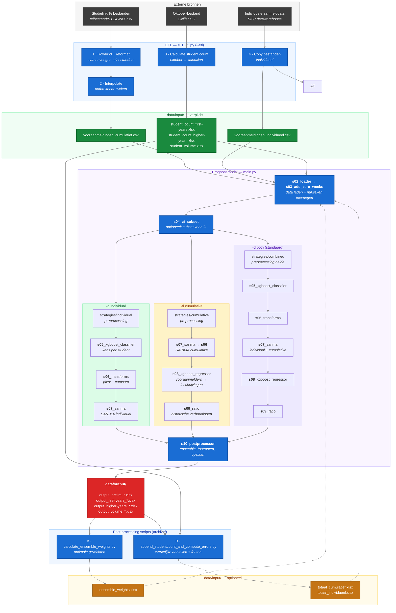

# Dataflow: van Studielink naar Prognose

Dit document beschrijft hoe ruwe Studielink-data en instellingsdata worden getransformeerd naar de bestanden in `data/input/`, en hoe die vervolgens door het prognosemodel worden verwerkt tot output.

---

## Wat moet ik aanleveren?

### Verplichte bestanden

| Bestand | Beschrijving | Bron | Wanneer nodig |
|---------|-------------|------|---------------|
| `vooraanmeldingen_cumulatief.csv` | Gewogen/ongewogen vooraanmelders per opleiding, herkomst, week, jaar | Studielink telbestanden → ETL stap 1 + 2 | Bij `-d c` of `-d b` (default) |
| `vooraanmeldingen_individueel.csv` | Een rij per student-aanmelding met persoonskenmerken | Direct uit SIS/datawarehouse van de instelling | Bij `-d i` of `-d b` (default) |
| `student_count_first-years.xlsx` | Werkelijk aantal eerstejaars per opleiding/herkomst/jaar | Oktober-bestand (1-cijfer HO) → ETL stap 3 | Altijd |
| `student_count_higher-years.xlsx` | Werkelijk aantal hogerjaars per opleiding/herkomst/jaar | Oktober-bestand (1-cijfer HO) → ETL stap 3 | Altijd |
| `student_volume.xlsx` | Totaal studentvolume per opleiding/herkomst/jaar | Oktober-bestand (1-cijfer HO) → ETL stap 3 | Altijd |

### Optionele bestanden

| Bestand | Beschrijving | Bron |
|---------|-------------|------|
| `ensemble_weights.xlsx` | Gewichten per model voor de ensemble-voorspelling | Gegenereerd door post-processing stap A |
| `totaal_cumulatief.xlsx` / `totaal_individueel.xlsx` | Historische voorspellingen (eerdere model-runs) | Gegenereerd door post-processing stap B |

> Bij een eerste run zijn de optionele post-processing bestanden nog niet beschikbaar. Het model draait zonder — ze worden pas aangemaakt na de eerste model-run via de post-processing scripts.

---

## Overzicht

---

## ETL Scripts (s01_etl.py)

Het ETL-script (`uv run main.py --etl`) transformeert ruwe data in `data/input_raw/` naar verwerkte bestanden in `data/input/`.

| Stap | Actie | Input | Output |
|------|-------|-------|--------|
| 1 | Rowbind + reformat | `data/input_raw/telbestanden/*.csv` | Samengevoegd CSV |
| 2 | Interpolatie | Samengevoegd CSV | `vooraanmeldingen_cumulatief.csv` |
| 3 | Studentaantallen | Oktober-bestand (1-cijfer HO) | `student_count_*.xlsx`, `student_volume.xlsx` |
| 4 | Kopieren | Individuele data | `vooraanmeldingen_individueel.csv` |

---

## Pipeline Executievolgorde

**Gedeelde stappen (alle modi):** `cli.py` → `s01_etl`* → `config.py` → `s02_loader` → `s03_add_zero_weeks` → `s04_ci_subset`*

| Stap | Fase | Individual (`-d i`) | Cumulative (`-d c`) | Both (`-d b`) |
|------|------|---------------------|---------------------|---------------|
| 6 | Preprocessing | `strategies/individual` | `strategies/cumulative` | individual → cumulative |
| 7 | Filtering | `strategies/base` | `strategies/base` | `strategies/base` |
| 8 | Classificatie | `s05_xgboost_classifier` | — | `s05_xgboost_classifier` |
| 9 | Transformatie | `s06_transforms` | — | `s06_transforms` |
| 10 | SARIMA | `s07_sarima` (individual) | `s07_sarima` → `s06_transforms` | `s07_sarima` (both) |
| 11 | XGBoost regressor | — | `s08_xgboost_regressor` | `s08_xgboost_regressor` |
| 12 | Ratio model | — | `s09_ratio` | `s09_ratio` |
| 13 | Postprocessing | `s10_postprocessor` | `s10_postprocessor` | `s10_postprocessor` |

<small>* alleen met `--etl` resp. `--ci test N`</small>

---

## Twee databronnen, twee sporen

**Cumulatief spoor (Studielink → model)**
Studielink levert wekelijks telbestanden met geaggregeerde aanmeldcijfers per opleiding. Het ETL-script voegt deze samen (stap 1), interpoleert ontbrekende weken (stap 2), en schrijft `vooraanmeldingen_cumulatief.csv`. Dit vormt de basis voor de `SARIMA_cumulative` voorspelling.

**Individueel spoor (instelling → model)**
De instelling levert per-student aanmelddata uit het eigen SIS/datawarehouse. Dit bestand wordt direct aangeleverd als `vooraanmeldingen_individueel.csv`. Het vormt de basis voor de `SARIMA_individual` voorspelling.

**Studentaantallen (oktober-bestand → ground truth)**
Het oktober-bestand (1-cijfer HO) bevat de werkelijke inschrijvingen na 1 oktober. Het ETL-script leidt hieruit de ground truth af die het model als referentie gebruikt.

Het prognosemodel combineert beide sporen via ensemble weging om een voorspelling te maken van het verwachte aantal studenten.

---

## Post-processing (feedback loop)

Na een model-run kunnen de volgende scripts worden gedraaid om de input voor de volgende run te verbeteren:

| Stap | Script | Input | Output |
|------|--------|-------|--------|
| A | `archive/calculate_ensemble_weights.py` | `totaal_cumulatief.xlsx` + `ensemble_weights.xlsx` | `ensemble_weights.xlsx` (bijgewerkt) |
| B | `archive/append_studentcount_and_compute_errors.py` | `totaal_*.xlsx` + `student_count_*.xlsx` | `totaal_*.xlsx` (bijgewerkt met werkelijke aantallen + fouten) |

---

## Output bestanden

| Bestand | Beschrijving |
|---------|-------------|
| `output_prelim_*.xlsx` | Voorlopige voorspellingen (tussenresultaat) |
| `output_first-years_*.xlsx` | Eerstejaars voorspellingen (eindresultaat) |
| `output_higher-years_*.xlsx` | Hogerjaars voorspellingen (eindresultaat) |
| `output_volume_*.xlsx` | Volume-voorspellingen (totaal) |

### Kolommen in output

Per rij: **opleiding + herkomst + examentype + week + jaar**

Voorspellingen: `SARIMA_individual`, `SARIMA_cumulative`, `Prognose_ratio`, `Ensemble_prediction`

Foutmaten: `MAE_*` (gemiddelde absolute afwijking), `MAPE_*` (procentuele afwijking)
