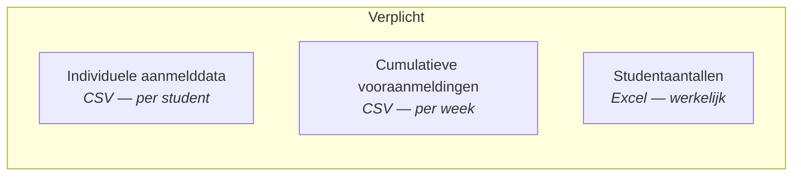
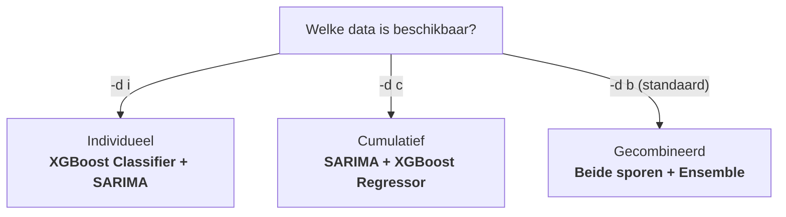
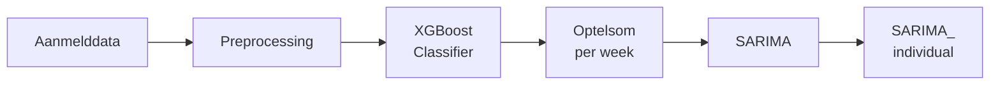
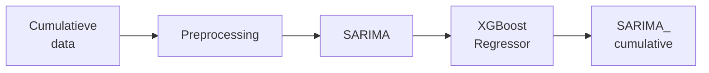
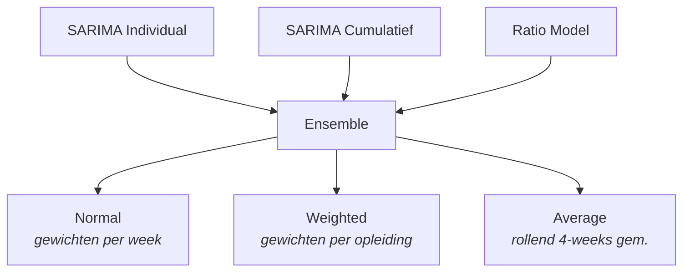
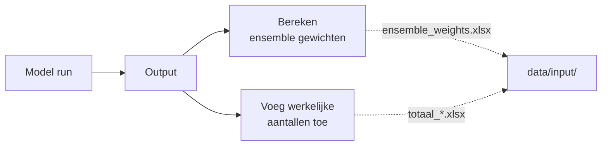

# Studentprognose

## Hoe voorspellen we studentinstroom?

Onboarding presentatie voor nieuwe teamleden

---

# Agenda

1. Het probleem
2. De oplossing
3. Databronnen (input)
4. Dataflow overzicht
5. Drie strategieen
6. Het individueel spoor
7. Het cumulatief spoor
8. Het ratio model
9. Ensemble: combineren van voorspellingen
10. Output en foutmaten
11. Hoe draai je het model?
12. Projectstructuur

---

# Het Probleem

### Universiteiten moeten maanden van tevoren weten hoeveel studenten er komen

- Via **Studielink** komen wekelijks vooraanmeldingen binnen
- Maar niet iedereen die zich aanmeldt, schrijft zich ook daadwerkelijk in
- Sommige opleidingen hebben een **numerus fixus** (capaciteitsbeperking)
- Faculteiten moeten plannen: docenten, zalen, budget

> **Kernvraag:** Hoeveel eerstejaars studenten krijgen we dit collegejaar, per opleiding?

---

# De Oplossing

Een **ML-model** dat wekelijks voorspelt hoeveel studenten zich zullen inschrijven

- Combineert **meerdere modellen** (SARIMA, XGBoost, Ratio) voor betere nauwkeurigheid
- Draait **lokaal** op je eigen machine (privacy-vriendelijk)
- Input: Studielink-data + instellingsdata
- Output: **Excel** met voorspellingen per opleiding, herkomst en week
- Voorspelt **per week** van week 39 (start collegejaar) tot week 38

---

# Databronnen (Input)



- **Individueel**: persoonskenmerken per aanmelding (nationaliteit, opleiding, geslacht, etc.)
- **Cumulatief**: wekelijkse totalen uit Studielink (gewogen/ongewogen vooraanmelders)
- **Studentaantallen**: de "ground truth" — hoeveel studenten er daadwerkelijk kwamen

---

# Studentverdeling naar herkomst

<iframe src="/chart_herkomst_pie.html" class="w-full h-[420px] border-0 rounded" />

---

# Wekelijkse aanmeldingen naar herkomst

<iframe src="/chart_weekly_applicants_area.html" class="w-full h-[420px] border-0 rounded" />

---

# Drie Strategieen



| Strategie | Wanneer? | Wat doet het? |
|-----------|----------|---------------|
| **Individueel** | Je hebt per-student data | Per student voorspellen of die zich inschrijft |
| **Cumulatief** | Je hebt alleen totalen | Wekelijkse totalen extrapoleren |
| **Beide** | Standaard | Combineert beide voor beste resultaat |

---

# Individueel Spoor



- **XGBoost Classifier** leert welke kenmerken voorspellen of iemand zich inschrijft — geeft per student een **kans** (0-100%)
- Kansen opgeteld tot **verwachte aantallen per week**
- **SARIMA** extrapoleert het verloop naar de toekomst (tot week 38)

---

# XGBoost Classifier: welke features tellen mee?

<iframe src="/chart_xgb_features.html" class="w-full h-[420px] border-0 rounded" />

---

# XGBoost Classifier: verdeling voorspelde kansen

<iframe src="/chart_xgb_probability.html" class="w-full h-[420px] border-0 rounded" />

---

# Deadline-effect op aanmeldingen

<iframe src="/chart_deadline_effect.html" class="w-full h-[420px] border-0 rounded" />

---

# Cumulatief Spoor



- **Stap 1 — SARIMA** voorspelt het weekverloop van vooraanmeldingen t/m week 38
- **Stap 2 — XGBoost Regressor** vertaalt die voorspelde vooraanmeldingen naar werkelijke inschrijvingen
- Waarom deze volgorde? SARIMA vult eerst de **ontbrekende toekomstige weken** aan — XGBoost heeft die complete reeks nodig als input om het eindaantal te schatten

---

# XGBoost Regressor: welke features tellen mee?

<iframe src="/chart_xgb_reg_features.html" class="w-full h-[420px] border-0 rounded" />

---

# Cumulatief Spoor — Visueel

<iframe src="/cumulative_visual.html" class="w-full h-[420px] border-0 rounded" />

---

# Individueel Spoor — Visueel

<iframe src="/individual_visual.html" class="w-full h-[420px] border-0 rounded" />

---

# Waarom SARIMA? Seizoenspatronen

<iframe src="/multiyear_visual.html" class="w-full h-[420px] border-0 rounded" />

---

# Van vooraanmelding naar inschrijving

<iframe src="/chart_waterfall.html" class="w-full h-[420px] border-0 rounded" />

---

# Ratio Model

### Het eenvoudigste model: historische verhoudingen

**Idee:** Als vorig jaar 60% van de vooraanmelders zich inschreef, gebruiken we dat als schatting.

1. Bereken per opleiding/herkomst de **historische ratio**: aanmeldingen / inschrijvingen
2. Gemiddelde over de **laatste 3 jaar**
3. Pas toe op huidige aanmeldingen:

> **Prognose = Huidige aanmeldingen / Gemiddelde ratio**

- Bij **numerus fixus** opleidingen: begrensd op de wettelijke capaciteit
- Wordt meegewogen in het **ensemble** als derde stem

---

# Ratio per opleiding (bubble chart)

<iframe src="/chart_ratio_scatter.html" class="w-full h-[420px] border-0 rounded" />

---

# Numerus fixus: capaciteitsbegrenzing

<iframe src="/chart_numerus_fixus.html" class="w-full h-[420px] border-0 rounded" />

---

# Ensemble: Combineren van Voorspellingen



| Methode | Hoe? |
|---------|------|
| **Normal** | Weekafhankelijke gewichten (bijv. week 35-37: 70% ind., 30% cum.) |
| **Weighted** | Per opleiding op basis van historische voorspelfouten |
| **Average** | Rollend gemiddelde over 4 weken voor stabiliteit |

---

# Ensemble gewichten per week (heatmap)

<iframe src="/chart_ensemble_weights_heatmap.html" class="w-full h-[420px] border-0 rounded" />

---

# Ensemble — Modellen convergeren

<iframe src="/ensemble_visual.html" class="w-full h-[420px] border-0 rounded" />

---

# Voorspelnauwkeurigheid per week

<iframe src="/accuracy_visual.html" class="w-full h-[420px] border-0 rounded" />

---

# Voorspelling vs. werkelijk per opleiding

<iframe src="/programmes_visual.html" class="w-full h-[420px] border-0 rounded" />

---

# Voorspeld vs. werkelijk (scatter)

<iframe src="/chart_scatter_pred_vs_actual.html" class="w-full h-[420px] border-0 rounded" />

---

# Betrouwbaarheidsband: onzekerheid neemt af

<iframe src="/chart_confidence_band.html" class="w-full h-[420px] border-0 rounded" />

---

# Output en Foutmaten

### Outputbestanden (Excel)

| Bestand | Beschrijving |
|---------|-------------|
| `output_prelim_*.xlsx` | Voorlopige voorspellingen (tussenresultaat) |
| `output_first-years_*.xlsx` | Eerstejaars voorspellingen (eindresultaat) |

### Kolommen in output

Per rij: **opleiding + herkomst + examentype + week + jaar**

Voorspellingen: `SARIMA_individual`, `SARIMA_cumulative`, `Prognose_ratio`, `Ensemble_prediction`

### Foutmaten

- **MAE** (Mean Absolute Error): gemiddelde absolute afwijking in studentaantallen
- **MAPE** (Mean Absolute Percentage Error): procentuele afwijking

---

# MAE per opleiding per model

<iframe src="/chart_mae_per_programme.html" class="w-full h-[420px] border-0 rounded" />

---

# Voorspelfouten per model (boxplot)

<iframe src="/chart_boxplot_error.html" class="w-full h-[420px] border-0 rounded" />

---

# Voorspelfout per opleiding (waterfall)

<iframe src="/chart_residuals.html" class="w-full h-[420px] border-0 rounded" />

---

# Feedback Loop



Na elke run worden **post-processing scripts** gedraaid die:

1. De output vergelijken met werkelijke cijfers
2. **Ensemble gewichten** herberekenen voor de volgende run
3. Historische voorspellingen opslaan voor trendanalyse

> Bij een eerste run zijn deze bestanden nog niet beschikbaar — het model draait zonder.

---

# Hoe draai je het model?

```bash
# Installeer uv en clone het project
curl -LsSf https://astral.sh/uv/install.sh | sh
git clone https://github.com/cedanl/studentprognose.git
cd studentprognose

# Draai het model (standaard: beide datasets)
uv run main.py -w 12 -y 2024 -d both
```

### Belangrijkste vlaggen

| Vlag | Betekenis | Voorbeeld |
|------|-----------|-----------|
| `-w` | Weeknummer(s) | `-w 12` of `-w 10 11 12` |
| `-y` | Collegejaar | `-y 2024` |
| `-d` | Dataset | `-d i` / `-d c` / `-d b` (both) |
| `-f` | Filtering config | `-f test` |
| `--ci test N` | CI-testmodus | `--ci test 2` |

---

# Projectstructuur

```
studentprognose/
  main.py                           # Startpunt en orchestratie
  src/
    cli.py                          # CLI argument parsing
    config.py                       # JSON configuratie laden
    data/
      etl.py                        # ETL: ruwe data → input data
      loader.py                     # Data inladen (CSV/Excel)
      preprocessing/
        add_zero_weeks.py           # Ontbrekende nulweken toevoegen
      transforms.py                 # Pivots en cumulatieve sommen
    models/
      xgboost_classifier.py        # Individuele kansvoorspelling
      sarima.py                     # Tijdreeksvoorspelling
      xgboost_regressor.py          # Vooraanmelders → inschrijvingen
      ratio.py                      # Historische verhoudingen
    strategies/
      base.py                       # Abstracte basisklasse
      individual.py                 # Individueel spoor
      cumulative.py                 # Cumulatief spoor
      combined.py                   # Gecombineerde strategie
    utils/
      weeks.py                      # Week-utilities en enums
      ci_subset.py                  # CI-testmodus subsetting
    output/
      postprocessor.py              # Ensemble, foutmaten, output
  configuration/                    # JSON configuratie + filters
  data/
    input/                          # Invoerbestanden (CSV/Excel)
    output/                         # Resultaten (Excel)
```

---

<style>
.slidev-layout { font-size: 0.5em; }
</style>

# Pipeline Executievolgorde

**Gedeeld:** `cli.py` → `etl`* → `config.py` → `loader` → `preprocessing/add_zero_weeks` → `utils/ci_subset`*

| Stap | Fase | Individual (`-d i`) | Cumulative (`-d c`) | Both (`-d b`) |
|------|------|---------------------|---------------------|---------------|
| 6 | Preprocessing | `strategies/individual` | `strategies/cumulative` | individual → cumulative |
| 7 | Filtering | `strategies/base` | `strategies/base` | `strategies/base` |
| 8 | Classificatie | `xgboost_classifier` | — | `xgboost_classifier` |
| 9 | Transformatie | `transforms` | — | `transforms` |
| 10 | SARIMA | `sarima` (individual) | `sarima` → `transforms` | `sarima` (both) |
| 11 | XGBoost regressor | — | `xgboost_regressor` | `xgboost_regressor` |
| 12 | Ratio model | — | `ratio` | `ratio` |
| 13 | Postprocessing | `postprocessor` | `postprocessor` | `postprocessor` |

<small>* standaard aan (skip met `--noetl`) resp. alleen met `--ci test N`</small>

---
layout: center
---

# Samenvatting

1. Het model voorspelt **wekelijks** hoeveel studenten zich zullen inschrijven
2. **Twee databronnen** (individueel + cumulatief) worden gecombineerd via ensemble
3. **Vier modellen**: XGBoost Classifier, XGBoost Regressor, SARIMA, Ratio
4. Output: **Excel** met voorspellingen en foutmaten per opleiding
5. Draait lokaal met `uv run main.py`

## Vragen?
