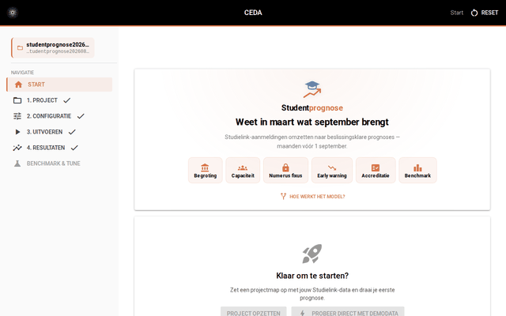

# Grafische interface

Naast de opdrachtregel (CLI) heeft studentprognose een optionele **grafische
interface**: een lokale webapp waarmee je een project opzet, de configuratie
instelt en voorspellingen draait zonder de terminal te hoeven gebruiken.

De GUI is een *schil* rond de CLI. Ze bevat geen eigen modellogica: elke actie
bouwt hetzelfde `studentprognose`-commando dat je ook zelf zou typen en voert dat
uit. Alles wat in de GUI kan, kan dus ook op de opdrachtregel — en omgekeerd.

<figure class="app-preview">
  <div class="app-preview__chrome">
    <span class="app-preview__dot app-preview__dot--red"></span>
    <span class="app-preview__dot app-preview__dot--yellow"></span>
    <span class="app-preview__dot app-preview__dot--green"></span>
    <span class="app-preview__bar">localhost:8080</span>
  </div>
  <video autoplay muted loop playsinline controls preload="metadata" poster="assets/studentprognose-walkthrough.gif" aria-label="Walkthrough van de grafische interface: van startpagina naar project, configuratie, uitvoeren en resultaten">
    <source src="assets/studentprognose-walkthrough.mp4" type="video/mp4">
    
  </video>
  <figcaption>Van startpagina tot prognose — de vijf stappen in de grafische interface.</figcaption>
</figure>

## Installeren en starten

De interface gebruikt [NiceGUI](https://nicegui.io/), een optionele
afhankelijkheid. Installeer die met de `gui`-extra en start de app:

```bash
uv run --extra gui python -m gui
```

Open daarna [http://localhost:8080](http://localhost:8080) in je browser.

!!! note "Optioneel, draait vanuit de broncode"
    NiceGUI is niet nodig om de CLI te draaien; de `gui`-extra installeert het
    alleen wanneer je die expliciet meegeeft. De interface zelf draai je vanuit
    een clone van de repository (`git clone` + `uv run --extra gui python -m gui`)
    — ze wordt niet meegeleverd in het PyPI-pakket.

## Direct proberen (demo)

De startpagina opent met het beeldmerk van Studentprognose — een diploma-baret
boven een stijgende pijl — en een korte waardepropositie met de belangrijkste
toepassingen van instroom-prognoses.

Op de startpagina staat een knop **"Probeer direct met demodata"**. Die zet
automatisch een tijdelijk project op, downloadt de demodataset en draait de
pipeline — allemaal met live voortgang. Voor de snelheid beperkt de demo zich tot
een subset (Master, Niet-EER). Na afloop open je met één klik het
resultatenoverzicht. Ideaal om de tool te verkennen zonder eigen data.

## Zo werkt de interface

De interface leidt je langs vijf stappen, in volgorde:

1. **Project** — kies of maak een projectmap met de juiste structuur. Je kunt
   hier optioneel de demodataset downloaden om het model direct te proberen.
   Elke uploadzone toont een **"Bron"**-strip die aangeeft waar je het bestand
   vandaan haalt: telbestanden komen van **Studielink** (op te vragen bij je
   Studielink-aansluitpunt of -beheerder, met een link naar de
   leveringsspecificatie), en het oktober-bestand komt uit je **eigen
   instelling** (SIS/datawarehouse zoals Osiris of Usis). Onderaan de uploadzone
   staat daarnaast een klikbare link **"Verwacht formaat"**: klik die uit om een
   tabel te zien met verwachte kolomnamen, beschrijvingen en voorbeeldwaarden.
2. **Configuratie** — stel de modelparameters en paden in. Wijzigingen worden
   kort na het typen automatisch bewaard; met **"Volgende"** sla je expliciet op
   en ga je door naar de volgende stap.
3. **Filteren** — bepaal op welke opleidingen, herkomst en examentypes je draait.
4. **Uitvoeren** — start de voorspelling en volg de voortgang live.
5. **Resultaten** — bekijk een overzicht van de voorspellingen.

Nieuwe gebruikers volgen deze stappen van boven naar beneden; de stap-indicator
bovenaan toont waar je bent. Terugkerende gebruikers springen via de zijbalk
direct naar de gewenste pagina. Stappen die een project vereisen zijn
uitgeschakeld tot je er een hebt gekozen, zodat je nooit vastloopt.

De zijbalk laat bovendien zien hoe ver je bent: **afgeronde** stappen staan zwart
met een vinkje; stappen die je **nog moet doen** en losse hulpmiddelen (zoals
*Benchmark & tune*) staan grijs, maar blijven klikbaar. Alleen *Start* en reeds
afgeronde stappen zijn dus zwart. Een stap geldt als afgerond zodra hij zijn
resultaat heeft opgeleverd — *Project* na het aanmaken, *Configuratie* nadat je
hebt opgeslagen, en *Uitvoeren* en *Resultaten* zodra er een voorspelling is
gedraaid.

Er kan maar één project tegelijk actief zijn. Zodra je een projectmap hebt
opgezet, staan de start-knoppen (**"Project opzetten"** en **"Probeer direct met
demodata"**) uitgeschakeld — een klik legt uit dat er al een project loopt. Om
dezelfde reden ligt in stap 1 (**"Project"**) de projectmap vast nadat je die hebt
aangemaakt: de mapkiezer verdwijnt, maar je kunt er nog wél je modus kiezen en
databestanden uploaden of vervangen. Een andere projectmap kiezen of opnieuw
beginnen doe je via de knop **"Reset"** rechtsboven (of de reset-knop in dat
uitlegvenster).

Op de **Uitvoeren**-pagina toont een **Dataverdeling**-kaart hoe je jaren
verdeeld worden over traindata, backtest en prognose. Het traindata-bereik is
geen vaste waarde maar wordt automatisch afgeleid uit je eigen data: het is de
**overlap tussen de jaren in je telbestanden en die in het oktober-bestand** —
de jaren waarvoor zowel aanmeld- als realisatiecijfers bestaan. De ondergrens
`min_training_year` uit de configuratie geldt daarbij als vloer. Een bijschrift
onder de kaart benoemt het gedetecteerde bereik expliciet (bijv. *"Traindata-bereik
2020–2025, afgeleid uit de overlap …"*). Zolang je nog geen telbestanden én
oktober-bestand hebt geüpload, valt de kaart terug op een generiek bereik en
meldt het bijschrift dat expliciet. De backtest-jaren (via *Jaren overslaan*)
worden uit de staart van dit bereik gehaald, zodat er altijd realisatiedata is om
tegen af te zetten; de training reikt nooit voorbij het laatste overlap-jaar.

Ditzelfde overlap-bereik bepaalt welke jaren je kunt **uitsluiten** van de
training. In de configuratie (tab **Geavanceerd** → *Uitsluitingsregels*) biedt
de keuzelijst *Jaar toevoegen* uitsluitend de jaren aan die daadwerkelijk in de
trainingsdata zitten — de overlap tussen tel- en oktober-jaren, begrensd door
`min_training_year`. Zo kun je geen jaar buiten je data kiezen (een jaar zonder
tel- óf oktober-data zit sowieso niet in de training, dus uitsluiten heeft daar
geen effect). Ook de snelknop *COVID-jaren uitsluiten* verschijnt alleen als je
data 2020 of 2021 dekt. Zolang je nog geen tel- én oktober-bestand hebt
geüpload, is er geen bereik bekend en meldt de sectie dat je die bestanden eerst
moet uploaden.

In dezelfde tab **Geavanceerd** kun je op twee plekken een opleiding kiezen via
een **zoekbare keuzelijst op Isatcode**. Bij *Filteren → Opleidingen* en bij
*Numerus fixus → Programmasleutel* toont de lijst de opleidingen die in je
geüploade data voorkomen — al vóór de eerste run, gelezen uit het
oktober-bestand en de telbestanden (aangevuld met de bewerkte bestanden zodra
die er zijn). Typ een **Isatcode** of een **opleidingsnaam** om te zoeken. Waar
de naam bekend is (uit het oktober-bestand of de telbestanden) staat die achter
de code — bijv. `56604 — B Geneeskunde` — maar de opgeslagen waarde is altijd de
**Isatcode**,
zodat de sleutel op het cumulatieve spoor aangrijpt. Staat een opleiding niet in
de lijst, dan kun je de Isatcode ook handmatig typen en toevoegen. De
filter-keuzelijst laat meerdere opleidingen tegelijk toe; de
numerus-fixus-keuzelijst kiest er één per rij.

De tab **Geavanceerd** bevat verder kaarten voor secties die eerder alleen via
het JSON-tabblad te bewerken waren:

- **Modelkeuze** bevat naast de drie modelkeuzes ook het **vroegste
  trainingsjaar** (`min_training_year`) — de ondergrens voor het
  traindata-bereik dat de Uitvoeren-pagina hierboven beschrijft.
- **Ensemble-uitzondering** (`ensemble_override_cumulative`) en **Uitgesloten
  van combined-modus** (`exclude_from_combined`) gebruiken dezelfde zoekbare
  opleiding-keuzelijst als *Filteren* en *Numerus fixus*, met dit verschil: je
  kunt hier zowel een Isatcode als een vrij getypte opleidingsnaam invoeren,
  omdat deze twee secties historisch op de leesbare naam kunnen keyen (zie
  [Configuratie → `ensemble_override_cumulative`](configuratie.md#ensemble_override_cumulative-ensemble-uitzondering-per-opleiding)).
- **Validatie — telbestand** stelt de datakwaliteitscontrole in die vóór de
  pipeline start draait: het scheidingsteken, de kolom waarop validatiefouten
  worden gegroepeerd, de toegestane herkomstcodes en de verplichte kolommen.
  Zonder deze kaart gebruikte de GUI altijd de ingebouwde package-defaults en
  negeerde ze een eventueel `validation`-blok in je `configuration.json`.
  Toegestane herkomstcodes en verplichte kolommen bewerk je als een lijst
  chips: typ een waarde en klik *Toevoegen*, of klik de **×** op een chip om
  hem te verwijderen.

Het tabblad **JSON** toont niet alleen je volledige configuratie als
doorzoekbare boom, maar is ook **direct bewerkbaar** — inclusief secties zonder
eigen formulierkaart (bijv. `model_features`, `columns`, `cumulative_input`).
Wijzig de boom of schakel naar de code-weergave, en klik **"Opslaan vanuit
JSON"** om weg te schrijven naar `configuration.json`. Dezelfde validatie als
de andere tabbladen geldt hier ook (bijv. moeten de ensemble-gewichten per
groep optellen tot 1,0): bij een fout verschijnt een melding onder de
JSON-boom en wordt er niets opgeslagen. Na een geslaagde opslag herlaadt de
pagina, zodat de tabbladen Basis en Geavanceerd de nieuwe waarden tonen.
Bewerk daarom niet gelijktijdig in de JSON-tab en de andere tabbladen — wat je
laatst opslaat wint.

Naast de vijf stappen is er een **Benchmark & tune**-tab: vergelijk alternatieve
modellen (met de winnaar gemarkeerd) en stem hyperparameters af, waarna je de
gevonden parameters met één klik naar de configuratie kopieert.

## Wanneer gebruik je wat?

| Situatie | Aanbeveling |
|----------|-------------|
| Verkennen, eenmalige run, visueel overzicht | Grafische interface |
| Geautomatiseerde runs (cron, taakplanner) | CLI met `--yes` |
| Reproduceerbare scripts / CI | CLI |
| Cloud / notebooks (data in geheugen) | Python-API (`run_pipeline_from_dataframes`) |

## Verhouding tot de CLI

De GUI stelt exact dezelfde opties beschikbaar als de CLI (zie
[Draaien & CLI](aan-de-slag.md)). Waar de documentatie een CLI-vlag noemt,
correspondeert die met een veld in de interface. De onderliggende pipeline,
modellen en uitvoerbestanden zijn identiek.
