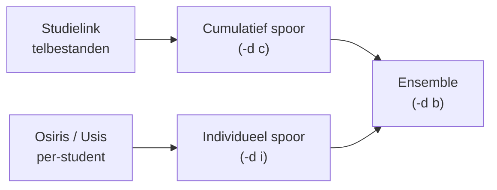

# Methodologie

Deze sectie legt per model uit **hoe het werkt**, **waarom deze keuze is gemaakt** en **wanneer je de output kritisch moet beoordelen**.

!!! info "Verhouding tot de Radboud-implementatie"
    De methodologie op deze pagina's komt voort uit het model dat oorspronkelijk bij Radboud is ontwikkeld. Die productie-implementatie draait intern en is niet publiek toegankelijk; deze CEDA-versie is de publieke, generieke variant.

    Concreet betekent dat:

    - Modelkeuzes (features, parameters, ensemble-gewichten) zijn dezelfde als die in de Radboud-implementatie en worden hier per pagina onderbouwd.
    - Radboud-specifieke configuratie (faculteitsnamen, programma-lijsten) is uit de gedeelde code gehaald en moet door elke instelling zelf worden ingevuld via `configuration.json`.
    - Waar de aanpak afwijkt van een rechttoe rechtaan implementatie — bijvoorbeeld de vaste week-38 override voor 2021 — wordt dat expliciet vermeld.

## Modellen in het ensemble

| Model | Pagina | Rol in de pipeline |
|-------|--------|--------------------|
| Individueel model (classifier + SARIMA) | [Individueel model](individueel.md) | End-to-end spoor: kans per student → geaggregeerde curve → extrapolatie naar week 38 |
| SARIMA / ETS / Theta / AutoARIMA | [Tijdreeksmodellen](sarima.md) | Tijdreeksextrapolatie op basis van historische aanmeldpatronen |
| XGBoost classifier | [XGBoost](xgboost.md) | Kans per individuele student dat deze zich inschrijft |
| XGBoost / Ridge / Random Forest | [Regressiemodellen](xgboost.md) | Vertaling van vooraanmelders naar verwachte inschrijvingen |
| Ratio-model | [Ratio-model](ratio-model.md) | Eenvoudige historische ratio als referentiemodel |
| Ensemble | [Ensemble](ensemble.md) | Gewogen combinatie van bovenstaande modellen |
| Benchmarks | [Benchmarks](benchmarks.md) | Vergelijking van alternatieve modellen |

Het cumulatieve spoor is configureerbaar: via `model_config.cumulative_timeseries` en `model_config.cumulative_regressor` in de [configuratie](../configuratie.md#cumulative_timeseries) kies je welk tijdreeksmodel en welk regressiemodel wordt gebruikt.

## Datasporen

De twee sporen zijn bewust onafhankelijk van elkaar ontworpen zodat instellingen die geen toegang hebben tot individuele aanmelddata toch een voorspelling kunnen maken via het cumulatieve spoor. Een end-to-end uitleg van het individueel spoor staat op [Individueel model](individueel.md).

### Welk model draait per modus?

| Modus | SARIMA | XGBoost regr. | Ratio | Ensemble-samenvoeging |
|-------|:------:|:-------------:|:-----:|:---------------------:|
| `-d c` | ✅ | ✅ | ✅ | ❌ (twee losse kolommen) |
| `-d i` | ✅ | ✅ (classifier) | ❌ | ❌ |
| `-d b` | ✅ | ✅ | ✅ | ✅ |

Alleen in `-d b` worden `SARIMA_individual` en `SARIMA_cumulative` samengevoegd tot één `Ensemble_prediction`; in `-d c` blijven het twee losse outputkolommen en in `-d i` is er maar één spoor en dus niets om te combineren. Zie [Ensemble](ensemble.md) voor de gewichtenlogica.

<iframe src="../assets/plots/pipeline_cumulative.html" width="100%" height="1020" frameborder="0" style="border-radius: 8px;"></iframe>

*Cumulatief spoor: wekelijkse telbestanden → SARIMA-extrapolatie → XGBoost regressor → voorspelde studenten (demodata)*

<iframe src="../assets/plots/pipeline_individual.html" width="100%" height="1020" frameborder="0" style="border-radius: 8px;"></iframe>

*Individueel spoor: per-student records → XGBoost classifier → ΣP = verwacht cohort (demodata)*

## Aannames en beperkingen

- Het model extrapoleert op basis van historische patronen. **Structurele breuken** (bijv. nieuwe opleiding, COVID-jaar) worden niet automatisch gedetecteerd.
- Ensemble-gewichten worden bepaald op historische fouten; een model dat in het verleden goed presteerde krijgt meer gewicht, ook al is de situatie veranderd.
- De SARIMA-parameters zijn per opleiding gefixed. Bij opleidingen met weinig historische data is de modelfit minder betrouwbaar.

## Dashboard-visualisatie

Na het opslaan van de resultaten genereert de pipeline een interactief Plotly-dashboard per modus. Het dashboard biedt grafieken per opleiding (voorspellingen, foutmaten, feature importance) en wordt opgeslagen als zelfstandig HTML-bestand onder `data/output/visualisaties/`. Zie [Output begrijpen](../output-begrijpen.md#interactief-dashboard) voor details.
