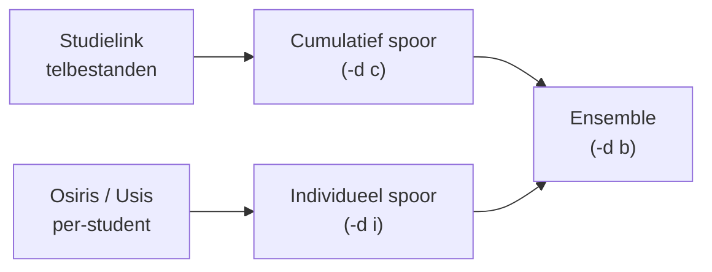

# Methodologie

Deze sectie legt per model uit **hoe het werkt**, **waarom deze keuze is gemaakt** en **wanneer je de output kritisch moet beoordelen**.

## Modellen in het ensemble

| Model | Pagina | Rol in de pipeline |
|-------|--------|--------------------|
| SARIMA | [SARIMA](sarima.md) | Tijdreeksextrapolatie op basis van historische aanmeldpatronen |
| XGBoost classifier | [XGBoost](xgboost.md) | Kans per individuele student dat deze zich inschrijft |
| XGBoost regressor | [XGBoost](xgboost.md) | Vertaling van vooraanmelders naar verwachte inschrijvingen |
| Ratio-model | [Ratio-model](ratio-model.md) | Eenvoudige historische ratio als referentiemodel |
| Ensemble | [Ensemble](ensemble.md) | Gewogen combinatie van bovenstaande modellen |

## Datasporen

De twee sporen zijn bewust onafhankelijk van elkaar ontworpen zodat instellingen die geen toegang hebben tot individuele aanmelddata toch een voorspelling kunnen maken via het cumulatieve spoor.

## Hyperparameter tuning

Met `--tune` optimaliseert de pipeline automatisch:

- **XGBoost**: grid search over hyperparameters (max_depth, learning_rate, subsample, etc.) met expanding-window cross-validatie
- **SARIMA**: AIC-gebaseerde orderselectie per tijdreeks

Gevonden parameters worden gecacht in `data/output/tuning_cache.json` en automatisch hergebruikt bij volgende runs. Zie [XGBoost](xgboost.md) en [SARIMA](sarima.md) voor details.

## Aannames en beperkingen

- Het model extrapoleert op basis van historische patronen. **Structurele breuken** (bijv. nieuwe opleiding, COVID-jaar) worden niet automatisch gedetecteerd.
- Ensemble-gewichten worden bepaald op historische fouten; een model dat in het verleden goed presteerde krijgt meer gewicht, ook al is de situatie veranderd.
- SARIMA-ordes worden per opleiding/herkomst/examentype geselecteerd via AIC (met `--tune`) of zijn vaste fallback-waarden. Bij opleidingen met weinig historische data is de modelfit minder betrouwbaar.
