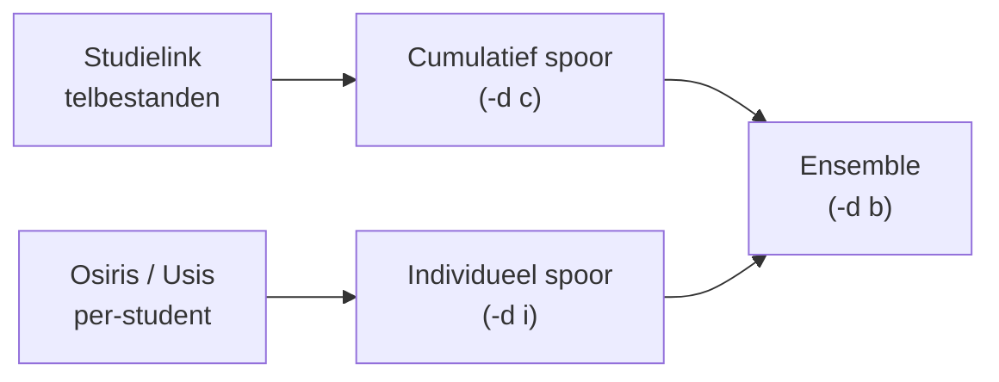

# Methodologie

Deze sectie legt per model uit **hoe het werkt**, **waarom deze keuze is gemaakt** en **wanneer je de output kritisch moet beoordelen**.

!!! info "Referentie-implementatie — Radboud Universiteit"
    Voor methodologische keuzes is **[radboudir/studentprognose](https://github.com/radboudir/studentprognose)** de **leidende referentie**. Die repo bevat de productie-implementatie van Radboud — de instelling waar dit model oorspronkelijk werd ontwikkeld en doorlopend wordt verfijnd.

    Gebruik deze referentie wanneer je:

    - **Methodologische keuzes wilt onderbouwen** (waarom een specifieke feature, parameter, of weging?)
    - **Een fork of eigen aanpassing maakt** — om de redenering vanuit de oorspronkelijke context te begrijpen
    - **De overdraagbaarheid wilt valideren** — vergelijk hoe Radboud-specifieke logica zich verhoudt tot de generieke implementatie hier

    Deze CEDA-versie volgt de Radboud-implementatie als blauwdruk; verschillen worden expliciet gedocumenteerd.

## Modellen in het ensemble

| Model | Pagina | Rol in de pipeline |
|-------|--------|--------------------|
| SARIMA | [SARIMA](sarima.md) | Tijdreeksextrapolatie op basis van historische aanmeldpatronen |
| XGBoost classifier | [XGBoost](xgboost.md) | Kans per individuele student dat deze zich inschrijft |
| XGBoost regressor | [XGBoost](xgboost.md) | Vertaling van vooraanmelders naar verwachte inschrijvingen |
| Ratio-model | [Ratio-model](ratio-model.md) | Eenvoudige historische ratio als referentiemodel |
| Ensemble | [Ensemble](ensemble.md) | Gewogen combinatie van bovenstaande modellen |

## Datasporen

De twee sporen zijn bewust onafhankelijk van elkaar ontworpen zodat instellingen die geen toegang hebben tot individuele aanmelddata toch een voorspelling kunnen maken via het cumulatieve spoor.

<iframe src="../assets/plots/pipeline_cumulative.html" width="100%" height="1020" frameborder="0" style="border-radius: 8px;"></iframe>

*Cumulatief spoor: wekelijkse telbestanden → SARIMA-extrapolatie → XGBoost regressor → voorspelde studenten (demodata)*

<iframe src="../assets/plots/pipeline_individual.html" width="100%" height="1020" frameborder="0" style="border-radius: 8px;"></iframe>

*Individueel spoor: per-student records → XGBoost classifier → ΣP = verwacht cohort (demodata)*

## Aannames en beperkingen

- Het model extrapoleert op basis van historische patronen. **Structurele breuken** (bijv. nieuwe opleiding, COVID-jaar) worden niet automatisch gedetecteerd.
- Ensemble-gewichten worden bepaald op historische fouten; een model dat in het verleden goed presteerde krijgt meer gewicht, ook al is de situatie veranderd.
- De SARIMA-parameters zijn per opleiding gefixed. Bij opleidingen met weinig historische data is de modelfit minder betrouwbaar.

## Dashboard-visualisatie

Na het opslaan van de resultaten genereert de pipeline een interactief Plotly-dashboard per modus. Het dashboard biedt grafieken per opleiding (voorspellingen, foutmaten, feature importance) en wordt opgeslagen als zelfstandig HTML-bestand onder `data/output/visualisaties/`. Zie [Output begrijpen](../output-begrijpen.md#interactief-dashboard) voor details.
