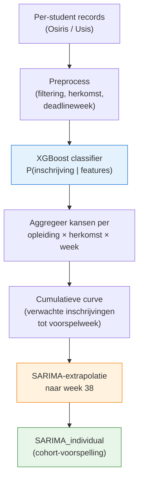
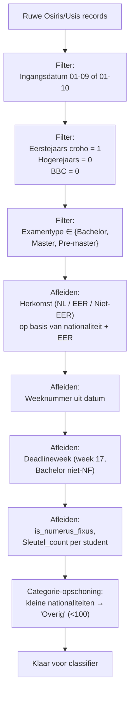
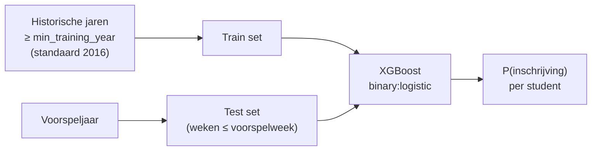
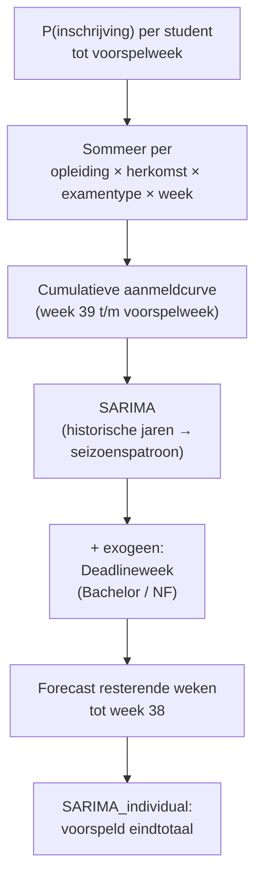

# Individueel model

Het individueel model voorspelt het verwachte cohortaantal door **per individuele student** een inschrijfkans te schatten en die kansen vervolgens te aggregeren tot een wekelijkse cumulatieve curve, die met SARIMA wordt geëxtrapoleerd naar week 38.

Dit is fundamenteel anders dan het cumulatieve spoor: in plaats van geaggregeerde wekelijkse telbestanden te modelleren, werkt dit spoor op **per-student records** uit Osiris/Usis. Dat geeft toegang tot persoonskenmerken (vooropleiding, herkomst, nationaliteit, …) die in geaggregeerde data verloren gaan.

!!! tip "Uitgebreide versie — Jupyter notebook"
    Een uitvoerbare versie van het classifier-deel met feature-engineering stap voor stap
    (lagged features, acceleration, exclusivity ratio) en feature importance op de demodata staat in
    [`notebooks/03_xgboost.ipynb`](https://github.com/cedanl/studentprognose/blob/main/notebooks/03_xgboost.ipynb).

## Activeren

Het individueel model wordt geactiveerd via de `-d` (dataset) vlag:

```bash
studentprognose -d i -w 6 -y 2024   # alleen individueel spoor
studentprognose -d b -w 6 -y 2024   # individueel + cumulatief → ensemble
```

In de `-d b` (both) modus draait dit model parallel aan het cumulatieve spoor; de uitkomsten worden gecombineerd in het [ensemble](ensemble.md).

## Pipeline op hoofdlijnen



Twee modellen, elk met een eigen rol:

| Stap | Model | Granulariteit | Output |
|------|-------|---------------|--------|
| Classificatie | XGBoost classifier | Per student | Inschrijfkans per individuele aanmelding |
| Extrapolatie | SARIMA | Per (opleiding × herkomst × examentype) | Verwacht cohortaantal op week 38 |

De classifier vertaalt persoonskenmerken naar een kans. De SARIMA extrapoleert de op die kansen gebaseerde cumulatieve aanmeldcurve verder het jaar in — tot aan de inschrijfdeadline.

## Stap 1 — Preprocessing

Voordat de classifier draait, wordt de ruwe per-student data gefilterd en verrijkt. De filterregels zijn bewust streng zodat het model alleen leert van vergelijkbare cases.



Belangrijke afleidingen:

- **Herkomst** — afgeleid uit nationaliteit + EER-vlag (`Nederlandse` → NL; overig EER → EER; rest → Niet-EER). Dit normaliseert kleine landverschillen tot drie hanteerbare groepen.
- **Deadlineweek** — markeert week 17 voor reguliere Bachelors (HBO-deadline) zodat het model de aanmeldpiek vlak voor de deadline expliciet kan modelleren.
- **`Sleutel_count`** — aantal aanmeldingen dat een student in dat jaar heeft gedaan. Hoog = student heeft meerdere opties; laag (vaak 1) = sterke commitment. Dit is de basis van het *exclusivity-signaal*.
- **`is_numerus_fixus`** — flag voor opleidingen met selectie. Bij NF gelden andere deadlines (week 1–2) en is de inschrijfkans systematisch hoger.

Studenten van wie de aanmelding is ingetrokken vóór de voorspelweek krijgen label 0 (niet ingeschreven). Dat voorkomt dat het model trainingsdata uit de toekomst gebruikt: wat na de voorspelweek gebeurt mag de classifier niet zien.

## Stap 2 — XGBoost classifier

### Wat doet het?

Per individuele student wordt de **kans op inschrijving** geschat: $P(\text{ingeschreven} \mid \text{features})$. De voorspelling is een waarschijnlijkheid tussen 0 en 1, geen harde label.

### Waarom XGBoost?

De inschrijfkans hangt af van meerdere niet-lineair interacterende factoren:

- *Herkomst × Examentype* — Niet-EER Masters gedragen zich anders dan NL Bachelors
- *Vooropleiding × Faculteit* — bepaalde combinaties hebben historisch lage doorstroming
- *Sleutel_count × Week* — een student met meerdere aanmeldingen vroeg in het jaar gedraagt zich anders dan eenzelfde profiel laat in het jaar

XGBoost vangt die interacties zonder dat ze expliciet als features hoeven te worden geconstrueerd, en is robuust bij de scheve klasseverdeling: de meeste vooraanmelders schrijven zich uiteindelijk wel in.

### Features

| Type | Features | Rationale |
|------|----------|-----------|
| Numeriek | Collegejaar, Sleutel_count, is_numerus_fixus | Tijd, commitment, regelgevingsregime |
| Categorisch — persoon | Nationaliteit, EER, Geslacht, Type vooropleiding | Persoonskenmerken die historisch met inschrijfkans correleren |
| Categorisch — locatie | Plaats / land / postcode (studieadres + geverifieerd adres + eerste vooropleiding) | Geografische signalen — een aanmelder uit de regio schrijft zich vaker in dan een verre aanmelder |
| Categorisch — opleiding | Examentype, Faculteit, Croho groepeernaam, Opleiding | Opleidingsspecifieke baseline-kansen |
| Categorisch — timing | Weeknummer, Deadlineweek | Het moment in het jaar bepaalt de betekenis van een aanmelding |
| Cumulatief (optioneel) | Gewogen vooraanmelders, Ongewogen vooraanmelders, Aanmelders met 1 aanmelding, Inschrijvingen (als ratio) | Combineert per-student data met geaggregeerde cohortinformatie als beide bronnen beschikbaar zijn |

Categorische features worden one-hot geëncodeerd. Onbekende categorieën in de testset worden genegeerd (`handle_unknown="ignore"`) zodat een nieuwe nationaliteit of een nieuwe opleiding de pipeline niet breekt.

### Training / test split



- **Train** — alle historische jaren vanaf `min_training_year` (configureerbaar, standaard 2016), exclusief het voorspeljaar zelf.
- **Test** — aanmeldingen uit het voorspeljaar tot en met de voorspelweek.
- **Vermijden van data leakage** — intrekkingen na de voorspelweek worden uit de trainingsdata gefilterd; je mag niet weten wat na week *w* gebeurt als je *voor* week *w* voorspelt.
- **Backtest-modus** — wanneer je een eerder jaar voorspelt (`predict_year < max_year`), worden zowel het voorspeljaar *als* het meest recente jaar uit de trainingsdata weggelaten. Anders zou het model toekomstige informatie zien die op het simulatie-moment nog niet bestond. Bij voorspellingen voor het meest recente jaar (`predict_year == max_year`) blijft alle historie tot dat jaar gewoon in de trainingsset.

Trainingsdata vóór `min_training_year` wordt bewust weggelaten omdat oudere cohorten een ander aanmeldgedrag vertonen (andere wettelijke kaders, andere studieduur, vóór de invoering van het BSA-regime).

### Aannames

- **Historische patronen blijven gelden** — het cohort van dit jaar gedraagt zich vergelijkbaar met eerdere cohorten op dezelfde features.
- **Intrekking = niet ingeschreven** — studenten die hun aanmelding vóór de voorspelweek introkken tellen als label 0.
- **Eerstejaars-filter is correct** — `Is eerstejaars croho opleiding == 1` definieert de doelgroep. Hogerejaars en BBC-ontvangers (al ingeschreven elders) worden expliciet uitgesloten.

Welke features in de praktijk het zwaarst meewegen is per cohort verschillend; de gegroepeerde feature importance (één balk per oorspronkelijke kolom, ook na one-hot encoding) staat in het interactieve dashboard en als losse grafiek op de [XGBoost-pagina](xgboost.md#feature-importance). Zie [XGBoost](xgboost.md) voor verdere technische details over de classifier (alternatieve modellen, configuratie).

## Stap 3 — Aggregatie en SARIMA-extrapolatie

De classifier produceert een kans per student. Die kansen zijn nog **geen cohortvoorspelling**: ze beschrijven alleen de aanmelders die *al binnen* zijn. Studenten die in de resterende weken nog gaan aanmelden zitten er nog niet in.

De extrapolatie verloopt in twee substappen:



1. **Aggregatie** — de individuele kansen worden gesommeerd per (opleiding × herkomst × examentype × week). De som van kansen is de verwachtingswaarde van het aantal inschrijvingen onder deze aanmelders.
2. **SARIMA-extrapolatie** — op de geaggregeerde cumulatieve curve wordt SARIMA toegepast om de overige weken tot aan week 38 in te vullen. Voor Bachelor-opleidingen in deadlineweek-periodes wordt een aparte SARIMA-orderingsstrategie gebruikt; zie [SARIMA](sarima.md#exogene-variabelen-individueel-spoor).

Het eindresultaat is een cohortvoorspelling per (opleiding × herkomst × examentype): de kolom `SARIMA_individual` in de output.

## Wanneer vertrouw je het individueel model?

Het individueel model is sterk wanneer:

- **Persoonskenmerken een rol spelen** — bijv. een opleiding waarbij vooropleiding of herkomst sterk bepalend is voor doorstroming. De classifier benut deze informatie expliciet.
- **De aanmelddata vroeg in het jaar al rijk is** — bij veel vroege aanmelders krijgt de classifier meer signaal en is de extrapolatie korter.
- **Numerus fixus-opleidingen** — bij NF wordt vroeg in het jaar al duidelijk wie kans maakt; persoonskenmerken zijn daar extra informatief.

## Wanneer vertrouw je het niet?

- **Nieuwe opleiding zonder historie** — de classifier heeft geen vergelijkbare cohorten gezien.
- **Beleidsbreuken** — wijziging in toelatingseisen of BSA-regels maakt historische gedragspatronen onvergelijkbaar.
- **Sterk afwijkende cohortcompositie** — bijv. na een internationale-marketingcampagne die de Niet-EER instroom verandert: de classifier ziet een feature-mix waar nauwelijks trainingsdata voor is.
- **Weinig aanmelders tot dusver** — zowel classifier (weinig test-records) als SARIMA (lange extrapolatie) verliezen betrouwbaarheid.
- **Eerste run zonder ensemble-gewichten** — in de `-d b` modus krijgt het individueel model dan het [default-gewicht](ensemble.md#configureerbare-ensemble-gewichten); pas na een volledig studiejaar zijn de gewichten zinvol geoptimaliseerd.

## Relatie tot andere modellen

| Model | Gebruikt door individueel spoor? | Hoe |
|-------|---------------------------------|-----|
| [XGBoost classifier](xgboost.md#xgboost-classifier-individueel-spoor) | Ja | Kernmodel — voorspelt P(inschrijving) per student |
| [SARIMA](sarima.md) | Ja | Extrapoleert de geaggregeerde curve naar week 38 |
| [XGBoost regressor](xgboost.md#xgboost-regressor-cumulatief-spoor) | Nee | Alleen in het cumulatieve spoor |
| [Ratio-model](ratio-model.md) | Nee | Alleen in het cumulatieve spoor, vergelijkingsbaseline in het ensemble |
| [Ensemble](ensemble.md) | Indirect | Gewogen combinatie van `SARIMA_individual` met `SARIMA_cumulative` (alleen `-d b`) |

In de `-d i` modus is `SARIMA_individual` direct de eindvoorspelling. In de `-d b` modus wordt het gecombineerd met `SARIMA_cumulative` via configureerbare ensemble-gewichten — zie [Ensemble](ensemble.md).

## Implementatie

| Bestand | Inhoud |
|---------|--------|
| `src/studentprognose/strategies/individual.py` | `IndividualStrategy` — orkestreert preprocessing, classificatie, aggregatie, SARIMA-aanroep |
| `src/studentprognose/models/xgboost_classifier.py` | `predict_applicant` — XGBoost classifier (train + predict) |
| `src/studentprognose/models/sarima.py` | `predict_with_sarima_individual` — extrapolatie op geaggregeerde curve |
| `src/studentprognose/data/transforms.py` | Cumulatieve sommen, pivots tussen long en wide format |
