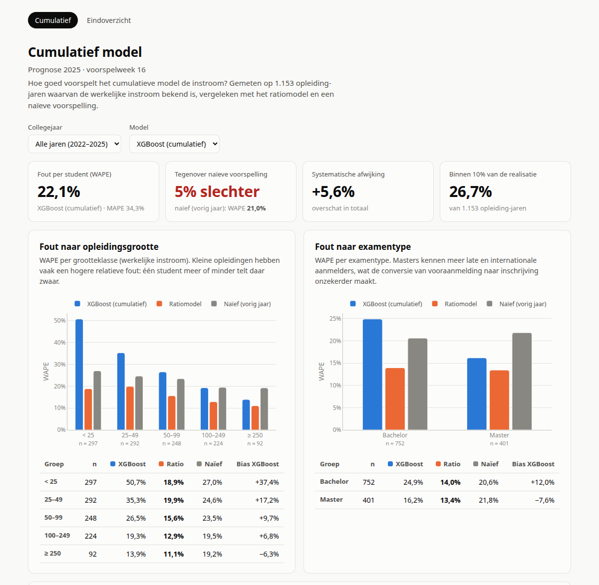
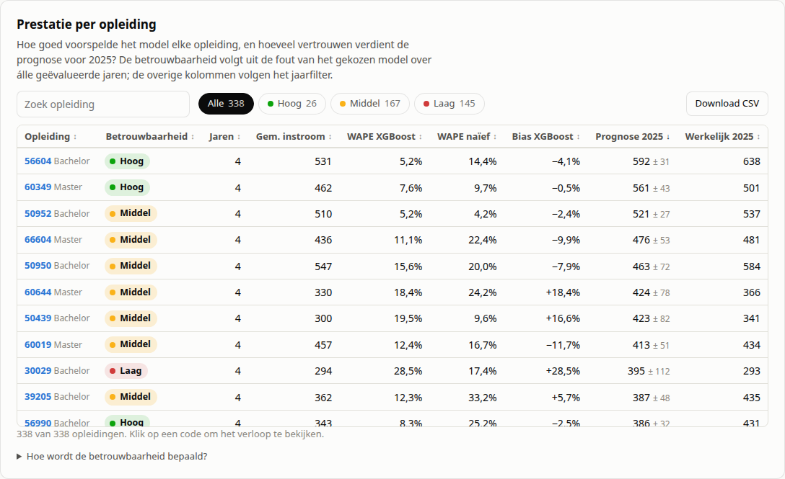

# Output lezen

De tool schrijft je resultaten naar `data/output/`. Het belangrijkste bestand is **`output_first-years_{modus}.xlsx`** — de prognose per opleiding.

!!! abstract "In het kort"
    - **Waar staat mijn prognose?** In `output_first-years_{modus}.xlsx`, kolom `Ensemble_prediction` (of `SARIMA_cumulative` bij alleen `-d c`).
    - **Kan ik hem vertrouwen?** Liggen de modellen dicht bij elkaar en is de historische fout (`MAE`/`MAPE`) klein? Zie [Wanneer is een prognose betrouwbaar?](#wanneer-is-een-prognose-betrouwbaar).
    - **Wat betekent een getal?** Zie [Kolomdefinities](#kolomdefinities). Onbekende term? Zie [Begrippen](begrippen.md).

!!! tip "Uitgebreide versie — Jupyter notebook"
    Een uitvoerbare versie die de outputkolommen stap voor stap interpreteert (met MAE/MAPE-voorbeelden en modelvergelijking): [`notebooks/06_output_interpreteren.ipynb`](https://github.com/cedanl/studentprognose/blob/main/notebooks/06_output_interpreteren.ipynb).

## Outputbestanden

| Bestand | Fase | Beschrijving |
|---------|------|-------------|
| `output_prelim_{modus}.xlsx` | Tussenresultaat | Voorlopige voorspellingen vóór ratio-model, ensemble en foutmaten. Nuttig voor debugging. |
| `output_first-years_{modus}.xlsx` | Eindresultaat | Eerstejaars voorspellingen per opleiding/herkomst/week |
| `output_volume_{modus}.xlsx` | Eindresultaat | Totaal studentvolume-voorspellingen (alleen bij `-sy v`) |
| `_totaal_{studentjaar}_{modus}.xlsx` | Audittrail | Doorlopend bestand waar elke run zijn rijen aan toevoegt. Wordt nooit als input ingelezen. Zie [Audittrail](#audittrail-_totaal_xlsx). |

`{modus}` is `cumulatief`, `individueel` of `beide`, afhankelijk van de gebruikte `-d` vlag.
`{studentjaar}` is `first-years`, `higher-years` of `volume`, afhankelijk van `-sy`.

## Audittrail (`_totaal_*.xlsx`)

Naast de week-specifieke `output_*.xlsx`-bestanden — die elke run worden overschreven — onderhoudt de pipeline een doorlopend audittrail per modus. Elke run voegt zijn rijen idempotent toe aan `data/output/_totaal_{studentjaar}_{modus}.xlsx`:

- **Bij eerste run** ontstaat het bestand met de kolommen van de huidige run.
- **Bij elke vervolgrun** worden de rijen toegevoegd. Bestaande rijen met dezelfde sleutel (jaar, week, opleiding, herkomst, examentype — de exacte kolomnamen volgen uit `column_roles`, in de standaardconfig: `Collegejaar`, `Weeknummer`, `Croho groepeernaam`, `Herkomst`, `Examentype`) worden **overschreven** in plaats van gedupliceerd — opnieuw draaien voor dezelfde week is dus veilig.
- **Run_date-kolom**: elke geschreven rij krijgt de datum van de run. Handig om te zien wanneer een voorspelling voor een (jaar, week)-combo is gegenereerd, bv. bij modelwijzigingen.

Het bestand wordt **nooit** door de pipeline als input ingelezen — de data loader leest enkel de paden uit `configuration.json`. Daarmee is een circulaire afhankelijkheid structureel uitgesloten.

**Waarvoor nuttig?** Trends over weken heen volgen (hoe ontwikkelde de voorspelling zich door het seizoen?) en achteraf reconstrueren wanneer een voorspelling is gemaakt (`Run_date`), zonder zelf wekelijkse exports te koppelen.

??? note "Bekende limieten"
    - **Filterwijzigingen tussen runs** worden niet gedetecteerd. Draai je week 10 met `-f base.json` en week 11 met een ander filter, dan leven beide rijensets naast elkaar. Documenteer zelf welke filterconfig bij welke run hoort.
    - **Modelversie-drift**: rijen uit oudere runs kunnen door een andere modelvariant zijn gegenereerd. `Run_date` maakt dit traceerbaar maar vervangt geen versiebeheer.
    - **Numerus-fixusvoorspellingen** worden afgekapt; de audittrail erft die waarden ongewijzigd.
    - **CI-modus** (`--ci test N`) schrijft géén audittrail — alleen reguliere runs.

## Kolomdefinities

Elke rij in de output beschrijft een combinatie van **opleiding × herkomst × examentype × week × jaar**.

### Voorspelkolommen

| Kolom | Beschikbaar bij | Omschrijving |
|-------|-----------------|-------------|
| `SARIMA_cumulative` | `-d c` of `-d b` | SARIMA-voorspelling op basis van Studielink telbestanden |
| `SARIMA_individual` | `-d i` of `-d b` | SARIMA-voorspelling op basis van individuele aanmelddata |
| `Prognose_ratio` | `-d c` of `-d b` | Ratio-modelvoorspelling (3-jaars historisch gemiddelde) |
| `Ensemble_prediction` | `-d b` | Gewogen combinatie van bovenstaande modellen |
| `Baseline` | `-d c` of `-d b` | Naïeve referentie: `vorig_jaar_inschrijvingen / vorig_jaar_aanmeldingen × huidige_aanmeldingen`. Identiek aan `Prognose_ratio`, maar expliciet benoemd voor gebruik als planningsreferentie. |

Als `-d b` is gebruikt maar individuele data ontbreekt, zijn `SARIMA_individual` en `Ensemble_prediction` leeg — zie [bekende valkuil](aan-de-slag.md#bekende-valkuil-stille-modus-downgrade).

### Actuele aanmeldcijfers in de output

De output bevat naast voorspellingen ook de actuele Studielink-cijfers voor het voorspelmoment:

| Kolom | Omschrijving |
|-------|-------------|
| `Gewogen vooraanmelders` | Gewogen aanmeldingen op predict_week (actueel) |
| `Ongewogen vooraanmelders` | Ongewogen aanmeldingen op predict_week |
| `Aantal aanmelders met 1 aanmelding` | Aanmelders die exclusief voor deze opleiding kozen |
| `Inschrijvingen` | Reeds ingeschreven studenten op predict_week |

Deze kolommen worden direct uit de cumulatieve Studielink-snapshot gevuld voor de rijen die overeenkomen met het voorspeljaar en de voorspelweek. Zo staan de voorspelling en de actuele stand altijd op dezelfde rij.

### Wanneer is de Baseline betrouwbaarder dan het ensemble?

De `Baseline` is in bepaalde situaties een betrouwbaardere leidraad dan `Ensemble_prediction`:

- **Stabiele, grote opleidingen** — als een opleiding jaar op jaar een vaste conversieverhouding (aanmelding → inschrijving) heeft, geeft de naïeve ratio een scherpe schatting met weinig ruis.
- **Weinig trainingsdata** — SARIMA en XGBoost hebben meerdere jaren nodig om betrouwbare patronen te leren. Bij een jonge opleiding (< 4 jaar data) is het ensemble onzeker; de ratio is dan vaak stabieler.
- **Grote afwijking tussen Baseline en Ensemble** — als de twee ver uit elkaar liggen (> 15–20%), is dat een signaal om de invoerdata te controleren. Het ensemble kan reageren op een anomalie in de aanmelddata; de ratio weerspiegelt puur het huidige aanmeldvolume.

Omgekeerd is het ensemble betrouwbaarder als de conversieverhouding snel verandert (nieuw instroombeleid, deadlineverschuiving) of als de opleiding een sterk niet-lineair aanmeldpatroon heeft dat de ratio niet kan volgen.

### Foutmaatkolommen

Foutmaten zijn gebaseerd op **historische modelfouten** — hoe goed presteerde elk model in voorgaande jaren op dezelfde opleiding/herkomst/week? Ze zijn dus geen maat voor de nauwkeurigheid van de huidige voorspelling.

| Kolom | Omschrijving |
|-------|-------------|
| `MAE_Ensemble_prediction` | Gemiddelde absolute fout van het ensemble in voorgaande jaren |
| `MAE_Prognose_ratio` | Gemiddelde absolute fout van het ratio-model |
| `MAE_SARIMA_cumulative` | Gemiddelde absolute fout van SARIMA cumulatief |
| `MAE_SARIMA_individual` | Gemiddelde absolute fout van SARIMA individueel |
| `MAPE_Prognose_ratio` | Gemiddelde procentuele fout van het ratio-model |
| `MAPE_SARIMA_cumulative` | Gemiddelde procentuele fout van SARIMA cumulatief |
| `MAPE_SARIMA_individual` | Gemiddelde procentuele fout van SARIMA individueel |

**MAE** (Mean Absolute Error): gemiddeld aantal studenten waarmee het model afweek.
Een MAE van 8 betekent: het model zat in het verleden gemiddeld 8 studenten naast de werkelijkheid.

**MAPE** (Mean Absolute Percentage Error): gemiddelde procentuele afwijking.
Een MAPE van 0.12 betekent: het model zat gemiddeld 12% naast de werkelijkheid.

!!! note "Foutmaten zijn alleen beschikbaar als er historische data is"
    Bij een eerste run of bij opleidingen zonder historische modeloutput zijn de MAE/MAPE-kolommen leeg.

## Wanneer is een prognose betrouwbaar?

Er is geen harde drempel, maar de volgende signalen helpen:

**Meer vertrouwen:**

- De individuele modellen (`SARIMA_cumulative`, `SARIMA_individual`, `Prognose_ratio`) komen dicht bij elkaar uit — consensus tussen modellen is een goed teken
- De historische MAE is klein ten opzichte van het voorspelde aantal
- De voorspelling is gemaakt op of na week 10 (meer aanmelddata beschikbaar)

**Minder vertrouwen:**

- Grote spreiding tussen de modellen — overweeg elk model afzonderlijk te beoordelen
- Hoge historische MAE of MAPE
- Opleiding met weinig historische data (nieuw, of klein aantal inschrijvingen per jaar)
- Vroeg in het jaar (vóór week 6) — de tijdreeks is dan erg kort
- Het jaar na een uitzonderlijk jaar (COVID, beleidswijziging)

De individuele modelkolommen staan bewust naast `Ensemble_prediction`, zodat je kunt controleren of de modellen het eens zijn, kunt signaleren welk model structureel afwijkt, en de baseline (ratio-model) tegen de complexere modellen kunt afzetten. Zie [Ensemble](methodologie/ensemble.md) voor hoe de gewichten tot stand komen.

## Foutmaten en numerus-fixusopleidingen

MAE en MAPE worden berekend **exclusief numerus-fixusopleidingen**. Voor deze opleidingen worden de foutkolommen op `NaN` gezet. De reden: bij numerus-fixusopleidingen wordt het voorspelde aantal afgekapt op de capaciteitslimiet, waardoor de modelfouten niet vergelijkbaar zijn met reguliere opleidingen.

## Het model evalueren (geaggregeerde metrieken)

De per-rij `MAE_*`/`MAPE_*`-kolommen hierboven zijn handig om één rij te lezen. Wil je een model **als geheel** beoordelen — één getal per model, of een eerlijke backtest over meerdere jaren — dan levert het pakket daarvoor de functies `evaluate_predictions`, `pivot_metrics` en `to_mlflow_metrics`.

Dat is Python-API-werk (notebooks, cloud, MLflow) en staat daarom op de pagina [Gevorderd gebruik → Het model evalueren](gevorderd-gebruik.md#het-model-evalueren).

## Interactief dashboard

Naast de Excel-bestanden kan de pipeline interactieve HTML-dashboards genereren onder `data/output/visualisations/`. Welke pagina's je krijgt, hangt af van de modus:

| Pagina | Wanneer | Beantwoordt |
|---|---|---|
| **Individueel** (`individual/dashboard.html`) | `-d i` of `-d b`, zodra het individuele model voorspellingen heeft | Hoe goed voorspelt het individuele model? |
| **Cumulatief** (`cumulative/dashboard.html`) | `-d c` of `-d b` | Hoe goed voorspelt het cumulatieve model? |
| **Eindoverzicht** (`final/dashboard.html`) | Altijd | Wat is de prognose, en hoeveel vertrouwen verdient die? |

Zonder `-d` draait de pipeline in modus `b` (beide) en krijg je dus alle drie. Alle pagina's hebben dezelfde opzet: een [herkomstfilter](#herkomstfilter-en-fout-naar-herkomst) bovenaan, kerncijfers, de fout naar opleidingsgrootte, examentype en herkomst, een tabel per opleiding met een **betrouwbaarheidslabel**, en (bij de modelpagina's) het verloop per opleiding. Elk model heeft op alle pagina's dezelfde kleur. De dashboards zijn zelfstandige HTML-bestanden (geen server of internet nodig) en openen in elke browser.

!!! info "Dashboard is opt-in"
    Het dashboard wordt alleen gegenereerd als je expliciet `--dashboard` meegeeft. Een voorbeeld:

    ```bash
    studentprognose --dashboard -d both -w 10 -y 2024
    ```

    Mocht dashboard-generatie onverhoopt falen, dan loopt de rest van de pipeline gewoon door en wordt de stack trace weggeschreven naar `data/output/dashboard_error.log`. De Excel-output blijft in dat geval beschikbaar.

!!! note "Dashboard toont alleen de laatste week"
    Bij een multi-week run (bijv. `-w 10:20`) toont het dashboard alleen de prognose van de **laatste week** in de reeks. De Excel-output bevat wel alle weken.

### Eindoverzicht (`final/dashboard.html`)

Altijd beschikbaar. Het eindoverzicht gaat over de **eindprognose**: het ensemble als dat er is, anders het model dat de prognose levert. Bovenaan staan de totale verwachte instroom, de verandering ten opzichte van vorig jaar, en welk deel van de verwachte studenten een prognose met betrouwbaarheid hoog of middel heeft. Daaronder volgen:

- **Prognose per opleiding**: prognose ± marge, werkelijke instroom vorig jaar, het verschil en het betrouwbaarheidslabel. Zoeken, sorteren, filteren en downloaden als CSV kan hier ook.
- **Prognose per herkomst**: NL, EER en niet-EER naast de instroom van vorig jaar. Deze grafiek toont altijd alle herkomstgroepen; kies je bovenaan een herkomst, dan wordt die groep uitgelicht.
- **Numerus fixus** (als je die hebt ingesteld): prognose tegenover de capaciteit. Alleen zichtbaar bij "alle herkomsten", want de capaciteit geldt voor de hele opleiding en niet per herkomstgroep.
- **Modelperformance**: dezelfde foutanalyses als op de modelpagina's, met het ensemble naast de losse modellen en de naïeve voorspelling. Zo zie je of het ensemble iets toevoegt.

Numerus-fixusopleidingen staan in de tabel met een eigen label: hun instroom wordt door de capaciteit bepaald, dus een modelfout zegt daar weinig.

### Cumulatief dashboard (`cumulative/dashboard.html`)

Beschikbaar bij `-d c` of `-d b`. Deze pagina beantwoordt één vraag: **hoe goed voorspelt het cumulatieve model, en waar gaat het mis?** Daarom staat er bewust weinig op:

1. **Kerncijfers**: de fout per student (WAPE), de vergelijking met een naïeve voorspelling, de systematische afwijking (bias) en het aandeel opleidingen dat binnen 10% van de realisatie zat.
2. **Fout naar opleidingsgrootte**: de WAPE per grootteklasse (< 25, 25–49, 50–99, 100–249 en ≥ 250 eerstejaars), naast het ratiomodel en de naïeve voorspelling, met het aantal opleidingen (n) per klasse.
3. **Fout naar examentype**: dezelfde vergelijking voor bachelor en master.
4. **Fout naar herkomst**: de WAPE per herkomstgroep (NL, EER, niet-EER), zie [hieronder](#herkomstfilter-en-fout-naar-herkomst).
5. **Fout per opleiding**: elke stip is een opleiding in één jaar. Klik op een stip om het verloop van die opleiding te openen.
6. **Prestatie per opleiding**: een tabel met per opleiding de historische fout, de vergelijking met naïef, de bias, de prognose met een marge en een **betrouwbaarheidslabel** (zie hieronder). Je kunt zoeken, sorteren en filteren op betrouwbaarheid, en de tabel downloaden als CSV (puntkomma-gescheiden, opent direct in Excel).
7. **Verloop per opleiding**: de gewogen vooraanmelders per week voor alle jaren, de prognose van de vooraanmelders na de voorspelweek, en de voorspelde en werkelijke instroom. Met het zoekveld kies je een opleiding. Onder de grafiek staat hoe het model het voor deze opleiding in eerdere jaren deed.



*Bovenste deel van de pagina na een backtest over 2022–2025 (demodata).*

**Hoe de fout gemeten wordt.** Alles wordt gemeten op de **voorspelweek**: dat is het moment waarop je de prognose in de praktijk gebruikt. De pipeline voorspelt per herkomstgroep, maar het dashboard telt die eerst op tot één getal per opleiding, want op dat niveau worden beslissingen genomen. De modellen worden vergeleken op **dezelfde set opleidingen**, zodat een model niet beter lijkt doordat het de moeilijke gevallen overslaat. Numerus-fixusopleidingen tellen niet mee: daar bepaalt de capaciteit de instroom, niet de aanmeldingen.

**Prognose en fout zijn op dezelfde optelling gebaseerd.** De WAPE en bias in de tabel horen bij precies het getal dat in de kolom "Prognose" staat. Dat vraagt een keuze voor herkomstgroepen die wel een voorspelling hebben, maar geen realisatie (bijvoorbeeld een voorspelling van 3 niet-EER-studenten, terwijl er in het telbestand geen enkele niet-EER-student bij die opleiding staat):

- Heeft de opleiding dat jaar wél een realisatie, dan telt zo'n herkomstgroep mee als **0 werkelijke studenten**: er kwam uit die groep niemand. De voorspelling voor die groep is dan volledig fout, en dat hoort in de fout terug te komen. Zou je de groep weglaten, dan meet je de fout op een kleiner getal dan de prognose die je ziet, en lijkt het model beter dan het is.
- Heeft een herkomstgroep wél een realisatie, maar geen voorspelling van een model, dan blijft het opleidingstotaal van dat model **leeg**. Een deelsom van de voorspellingen afzetten tegen de volledige realisatie zou een te lage prognose en een vertekende fout opleveren.
- In een lopend jaar (nog geen realisatie) is de prognose simpelweg de som van de voorspelde herkomstgroepen.

Onder **"Hoe worden deze cijfers berekend?"** staat hoeveel herkomstgroepen als 0 zijn meegeteld.

!!! warning "Wanneer kijk je kritisch naar deze cijfers?"
    - **Veel herkomstgroepen als 0 meegeteld?** Dan kan het zijn dat het telbestand onvolledig is (een herkomst ontbreekt, of een jaar is maar gedeeltelijk geladen), in plaats van dat er echt niemand kwam. Controleer de teldata voordat je de fout aan het model toeschrijft.
    - **"Werkelijk vorig jaar" veel hoger dan de realisatie die je kent?** Dat kan wijzen op dubbeltelling in het telbestand, bijvoorbeeld doordat twee versies van hetzelfde bestand samen zijn ingelezen. Dat vertekent zowel de naïeve voorspelling als de fout.



*Prestatie per opleiding, gesorteerd op prognose (demodata).*

**Kun je de prognose van een opleiding vertrouwen?** Het label is gebaseerd op hoe goed het gekozen model deze opleiding in eerdere jaren voorspelde:

| Label | Wanneer | Wat doe je ermee |
|---|---|---|
| 🟢 **Hoog** | WAPE ≤ 10%, minstens twee geëvalueerde jaren, én niet slechter dan de naïeve voorspelling | Prognose is bruikbaar als planningsgetal |
| 🟡 **Middel** | WAPE ≤ 25%, of een lage fout met maar één jaar of niet beter dan naïef | Gebruik de prognose met de getoonde marge |
| 🔴 **Laag** | WAPE boven 25% | Gebruik de prognose alleen met een ruime marge en eigen kennis van de opleiding |
| ⚪ **Onbekend** | Nog geen jaar met realisatie | Nog niet te beoordelen |

Het label kijkt altijd naar **alle** geëvalueerde jaren, ook als je het jaarfilter gebruikt: betrouwbaarheid gaat over het trackrecord, niet over één jaar. De grenzen van 10% en 25% zijn dezelfde als de kleurgrenzen in de andere dashboardpagina's. De **marge** (± prognose × WAPE) is de gemiddelde afwijking die het model voor deze opleiding had. Dat is een vuistregel, geen statistisch betrouwbaarheidsinterval: in een uitzonderlijk jaar kan de werkelijke fout groter zijn.

Een opleiding telt voor elk model mee in de jaren waarvoor dat model een voorspelling had. In de groepsvergelijkingen hierboven worden de modellen juist op precies dezelfde set opleidingen vergeleken. Daardoor kunnen de aantallen in de tabel en de grafieken iets verschillen.

**Waarom WAPE als hoofdmaat?** Bij MAPE telt elke opleiding even zwaar. Een opleiding met 8 studenten waarvan er 4 verkeerd voorspeld zijn (50% fout) weegt dan net zo zwaar als een opleiding met 400 studenten. WAPE telt de absolute fouten op en deelt door de totale instroom, en is dus de fout "per student". MAPE staat er als tweede maat naast.

**De naïeve voorspelling** is "dit jaar komen er evenveel studenten als vorig jaar". Is het model niet beter dan deze voorspelling, dan voegt het voor die groep weinig toe. Wees dan terughoudend met de prognose, of kijk welk model in die groep het wel goed doet.

!!! warning "Performance vraagt om realisatie"
    De fout valt alleen te meten voor collegejaren waarvan de werkelijke instroom bekend is. Voorspel je het lopende jaar, dan toont de pagina alleen het verloop, met een melding. Draai voor inzicht in de prestaties een backtest over afgeronde jaren, bijvoorbeeld:

    ```bash
    studentprognose -w 16 -y 2022:2025 -d c --dashboard
    ```

    Hoe meer jaren, hoe betrouwbaarder de cijfers. Kijk bij kleine groepen (lage n) vooral naar de richting, niet naar het precieze percentage.

!!! note "Grootteklasse op basis van de realisatie"
    De grootteklasse wordt bepaald door de **werkelijke** instroom. Dat is eerlijk voor de evaluatie, maar je weet het vooraf niet precies. Gebruik de klasse daarom om te zien waar het model zwak is, niet als indeling bij een lopende prognose.

### Herkomstfilter en fout naar herkomst

Bovenaan elke dashboardpagina (cumulatief, individueel en eindoverzicht) kies je **Alle herkomsten**, **NL**, **EER** of **Niet-EER**. De standaard is "alle herkomsten": de herkomstgroepen worden per opleiding opgeteld, omdat op dat niveau de meeste beslissingen vallen.

Kies je een herkomst, dan wordt alles opnieuw berekend voor alleen die groep, per opleiding × herkomst: kerncijfers, fout naar grootte en examentype, fout per opleiding, de tabel (prognose, WAPE, bias, betrouwbaarheid) en het verloop per opleiding. Twee dingen veranderen mee:

- De **naïeve voorspelling** is dan de realisatie van vorig jaar van díe herkomstgroep. Zo vergelijk je het model met een eerlijke basislijn voor dezelfde groep.
- De **grootteklasse** is de instroom binnen die herkomstgroep. Een grote opleiding met 15 EER-studenten valt bij het filter EER dus in de klasse < 25.

Op het eindoverzicht volgen de kerncijfers het filter; de grafiek "Prognose per herkomst" blijft alle groepen tonen. De gekozen herkomst staat in de adresbalk (bijvoorbeeld `#herkomst=EER`) en gaat mee als je naar een andere dashboardpagina klikt, zodat je een link naar een specifieke weergave kunt delen. Een CSV-download krijgt een kolom Herkomst en de herkomst in de bestandsnaam.

**Uitsplitsing per opleiding.** Wil je voor één opleiding zien welke herkomstgroep de fout veroorzaakt, dan hoef je niet te wisselen tussen filters. In de weergave "alle herkomsten" klik je in de tabel op het pijltje (›) vóór de opleiding. Daaronder verschijnen NL, EER en niet-EER, elk met hun eigen prognose, WAPE, bias, betrouwbaarheid en naïeve voorspelling. Is de realisatie van het voorspeljaar al bekend (een backtest), dan toont de kolom **Fout** per rij hoeveel studenten de prognose ernaast zat, en hoeveel procent dat is. De prognoses, realisaties en fouten van de herkomstgroepen tellen op tot de opleidingsrij erboven. Met **Herkomst uitklappen** klap je alle opleidingen tegelijk open. Uitgeklapte opleidingen gaan met hun herkomstregels mee in de CSV-download.

Een opleiding met een redelijke totale fout kan zo een herkomstgroep verbergen die structureel misgaat: bijvoorbeeld een NL-voorspelling die 3% afwijkt en een niet-EER-voorspelling die 50% te hoog zit. Andersom heeft een kleine herkomstgroep snel een groot percentage. Kijk dan naar het aantal studenten erachter voordat je conclusies trekt.

**Waarom per herkomst kijken?** Herkomstgroepen gedragen zich verschillend: internationale studenten melden zich eerder of later aan, trekken zich vaker terug en zijn gevoeliger voor beleid (taal, visa, collegegeld). Een goede fout op opleidingsniveau kan verbergen dat het model één groep structureel over- en een andere onderschat.

**Fout naar herkomst.** In de weergave "alle herkomsten" staat naast de fout naar opleidingsgrootte en examentype een kaart met de WAPE per herkomstgroep, per model en naast de naïeve voorspelling. Lees die met twee kanttekeningen:

- Deze WAPE wordt gemeten per opleiding × herkomst. Fouten tussen herkomstgroepen vallen daardoor **niet tegen elkaar weg** (5 NL-studenten te veel en 5 EER-studenten te weinig is op opleidingsniveau 0 fout, hier 10). De WAPE ligt hier dus meestal hoger dan op opleidingsniveau; dat is geen tegenstrijdigheid.
- Kleine herkomstgroepen, vaak EER en niet-EER bij masters, hebben relatief grote fouten: een paar studenten verschil is al snel tientallen procenten. Kijk daar vooral naar de richting (bias) en naar het verschil met naïef, niet naar het precieze percentage.

### Individueel dashboard (`individual/dashboard.html`)

Beschikbaar bij `-d i` of `-d b`, zodra het individuele model voorspellingen heeft. De opzet is gelijk aan het cumulatieve dashboard: herkomstfilter, kerncijfers, fout naar opleidingsgrootte, examentype en herkomst, fout per opleiding en de tabel met betrouwbaarheid.

Het **verloop per opleiding** laat hier iets anders zien: het verwachte aantal inschrijvingen per week. Dat is de som van de inschrijfkansen die XGBoost per aanmelder berekent (tot en met de voorspelweek), doorgetrokken naar het eind van het seizoen met SARIMA. Rechts staan de werkelijke instroom van eerdere jaren (★) en de voorspelde instroom (◆).
